# usdGeospatial — a codeless CRS schema for OpenUSD, proven by two runtimes

A **codeless** geospatial Coordinate Reference System (CRS) schema for OpenUSD: a CRS prim plus
a binding API, `skipCodeGeneration = true`, so the schema is a pure **data contract** and all
resolution behavior lives in the example runtimes — not in the schema. It is name- and
layout-aligned with **Simon Haegler's (Esri) `geospatial-prototype`**, so the two read as the
*same* proposal artifact, with one deliberate design difference: **binding is resolved at
runtime, not baked into the scene.**

We prove the contract by shipping **two independent runtimes** that resolve the *same* authored
scene to the *same* world (Earth-Centered, Earth-Fixed / ECEF) and **agree to 0.0 mm**: a
**Python reference runtime** (the oracle) and a compiled **C++ Hydra scene-index plugin** that
auto-inserts into usdview.

> **On the figures, up front (it matters for review):** every embedded *figure* in this document
> is a **Matplotlib plot** of coordinates the runtime computed (`matplotlib.use("Agg")`) — a
> diagram or scatter/line plot of *resolved numbers*, **not** a renderer screenshot. They prove
> the resolver is correct, not that a GPU drew them. The one exception, called out explicitly, is
> the **Hydra Storm render proof** (§[The proofs](#the-proofs)), which *is* real renderer output.
>
> **What Matplotlib is doing here (to avoid a category error):** it is **not** "consuming a USD
> stage." It sits in the *same seat* as a Hydra renderer or an analytics pass — a plain **consumer
> of the resolver's output** (normalized ECEF). A compliant implementation produces the correct
> ECEF; what draws or analyzes it is agnostic. The USD-native version of exactly this point is the
> **usdview-on-earth2 Storm render** below — same resolved data, drawn by a real Hydra chain.

<!-- slide:title subtitle="a codeless CRS schema for OpenUSD, proven by two runtimes" -->

## What it is

The schema is `usdGeospatial` (codeless). It defines two things and nothing else:

- **`CoordinateReferenceSystem`** (typed prim): `crs:wkt` (OGC WKT2, authoritative) plus optional
  `crs:epsg`, `crs:displayName`, `crs:epoch` (dynamic CRS), `crs:gridFiles` (external PROJ grids).
- **`BindingAPI`** (single-apply, `canOnlyApplyTo Xformable`): `crs:position` — always
  `(lon/E, lat/N, h)` — plus `rel crs:binding` → a `CoordinateReferenceSystem`.

That is the whole proposed surface. Because it is codeless, `usdGenSchema` emits only
`generatedSchema.usda` + `plugInfo.json` (no compiled C++ types); USD loads the typed prim and the
applied API from those, so `crs:*` properties authored with `custom=False` are **truthfully**
schema-defined. This mirrors the shape of the landed OpenUSD Gaussian / `hdParticleField`
contribution — *schema + sample runtime(s) + data converter + docs, shipped together*, with the
schema as pure data and all behavior in the example(s). Here the runtimes are the Python
`resolve_runtime.py` and the C++ Hydra scene index, and the dataset is real OSS Earth-2 / GFS `t2m`.

<!-- slide:text eyebrow="The proposal" title="A codeless geospatial CRS schema" body="Pure-data schema: a CRS prim + a binding API, `skipCodeGeneration=true` (no compiled types). | All resolution behavior lives in the example runtimes, not the schema. | Same shape as the landed Gaussian / particleField contribution: schema + sample runtime(s) + converter + docs. | Two runtimes here: Python `resolve_runtime.py` (oracle) and a C++ Hydra scene index that auto-inserts into usdview." -->

**Repository layout — two sibling directories, one schema:**

- **`usdGeospatial/`** (this directory) — the codeless schema, the **Python reference runtime**
  (`src/resolve_runtime.py`), the Earth-2 data converter, the test suite, and the figures.
- **`../usdGeospatialSceneIndex/`** — the compiled **C++ Hydra scene-index plugin**, a second,
  illustrative runtime (modeled on the Gaussian-splat `hdParticleField` example — a reference, not
  a prescribed renderer path). It has its own README (Design, Files, Parity, Building, Environment).

## The proofs

Lead with these; everything after is *how* and *why*. Each is checkable by an independent reviewer
and non-circular — ground truth is closed-form WGS84 geodesy (first principles) and **NOAA NCAT**
benchmark coordinates, never a parallel PROJ call graded against itself.

<!-- slide:section title="The proofs" subtitle="Four things an independent reviewer can check." -->

**1 — No overfit: a real third-party asset on real tiles.** The **NVIDIA OpenUSD-plugin-samples
Deutsche Bahn railway** (Apache-2.0; ~1,470 track curves on 3 geospatial tiles near Hamburg) is
authored in the *original Omniverse* geospatial schema (`omni:geospatial:wgs84:*`, lat-first).
`src/convert_omni_geospatial.py` converts it to our `crs:binding`/`crs:position` form and it
resolves — leaves *and* its anchor + Cartesian-curve subtree via injection — with **no runtime
changes**. Data we did not author, in a schema we did not design.

<!-- slide:image src="docs/railway_render.png" eyebrow="Proof · no overfit" title="Real third-party asset on real tiles" caption="Matplotlib plot (not a render): an external Deutsche Bahn railway (~1,470 curves) authored in the original Omniverse schema, converted to crs:binding/crs:position, resolved onto three real geospatial tiles near Hamburg." -->

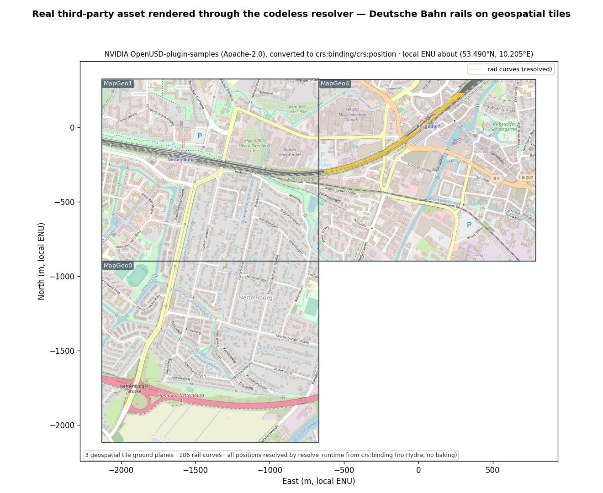

**2 — Co-registration against an independent authority.** The same monument near the Empire State
Building, authored three independent ways — geographic (EPSG:4979), UTM 18N (EPSG:32618), and
NY State Plane (EPSG:32118) — each from independent **NOAA NCAT** coordinates (not by inverting one
transform) — all resolve through the schema to the **same ECEF point**, matching closed-form WGS84
geodesy to **≤ ~0.5 mm** (the residual is real conformal-projection grid noise). The negative
control (resolve while *ignoring* `crs:binding`) collapses ~6,400 km off the globe. An axis-order or
geodesy bug has nowhere to hide, because the reference side makes no `always_xy` assumption to
cancel against.

<!-- slide:image src="docs/coherence.png" eyebrow="Proof · co-registration" title="Three CRSs, one ECEF point" caption="The same monument authored three ways (geographic / UTM 18N / NY State Plane) from independent NOAA NCAT coordinates co-registers to one ECEF point to ≤ ~0.5 mm — vs closed-form WGS84 geodesy, not a parallel PROJ call. Red blob = negative control (bindings ignored)." -->

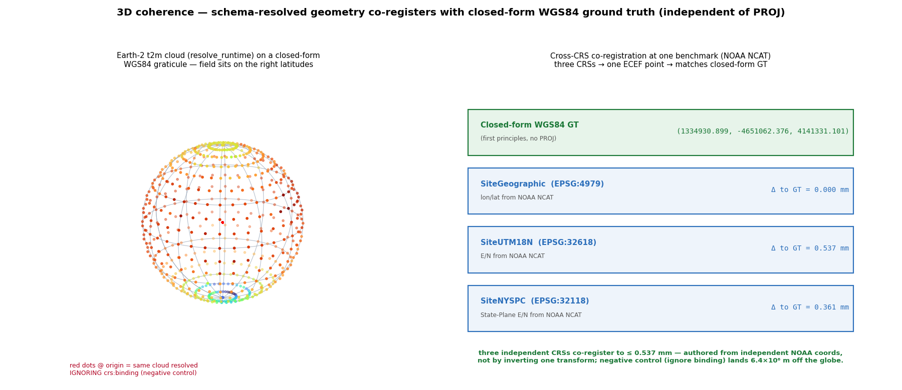

> **Scope of this proof:** graticule + benchmark co-registration, **not** a draped satellite /
> terrain raster basemap (roadmap). It demonstrates **point / leaf** coherence; **anchor +
> Cartesian-subtree** coherence is shown by anchor injection (§[Coexisting with
> UsdGeomXformable](#coexisting-with-usdgeomxformable-inject-dont-bake)).

**3 — One schema, two independent runtimes (0.0 mm) — a first conformance pass.** *Correctness*
is carried by Proof 2: the match against **NOAA NCAT + closed-form WGS84 geodesy**, which are
independent authorities, not this proposal's own code. What *this* proof adds is a different thing,
and we're careful about the claim: two implementations agreeing to 0.0 mm shows the **contract is
unambiguous enough to build twice and get the same answer** — robustness, and a first conformance
pass — **not**, by itself, that the semantics are correct (two implementations of the same misreading
would also agree perfectly). Correctness comes from the independent authority; the two-runtime
agreement shows the *data contract* is well-specified. The point of a codeless schema is that the
contract is *data*, not one implementation — so any number of runtimes must land on the same world.
The Python reference and the compiled **C++ Hydra scene index** share *nothing* but the authored
schema (different language, pipeline layer, and PROJ binding), yet resolve the same authored stage
to the same world. `../usdGeospatialSceneIndex/run_parity.sh` reports:

- **CRS engine vs closed-form geodesy (the correctness authority):** 9/9 datasets, **0.0 mm**
- **Stage-level resolver vs Python oracle + ground truth:** 30/30, **0.0 mm**
- **Hydra scene index (xform pulled via `HdXformSchema`, as a renderer would) vs oracle + ground
  truth:** 30/30, **0.0 mm**; negative control: **without** the scene index, stock Hydra puts
  these georef prims at the origin.

Visual parity on the real railway: across **3,526 rail vertices** + tile corners the two runtimes
agree to **median 0.40 mm, worst 0.68 mm**; `fig_runtime_parity.py` self-asserts this and **fails
the build if disagreement exceeds 1 mm**.

<!-- slide:image src="docs/multi_runtime.png" eyebrow="Proof · contract not implementation" title="Two independent runtimes, 0.0 mm" caption="Robustness / first conformance pass (correctness is Proof 2 vs NCAT + closed-form geodesy): the Python reference runtime and the compiled C++ Hydra scene index resolve the same authored stage to the same world, agreeing to 0.0 mm — the data contract is unambiguous enough to build twice the same way. A third runtime plugs into the same seam." -->

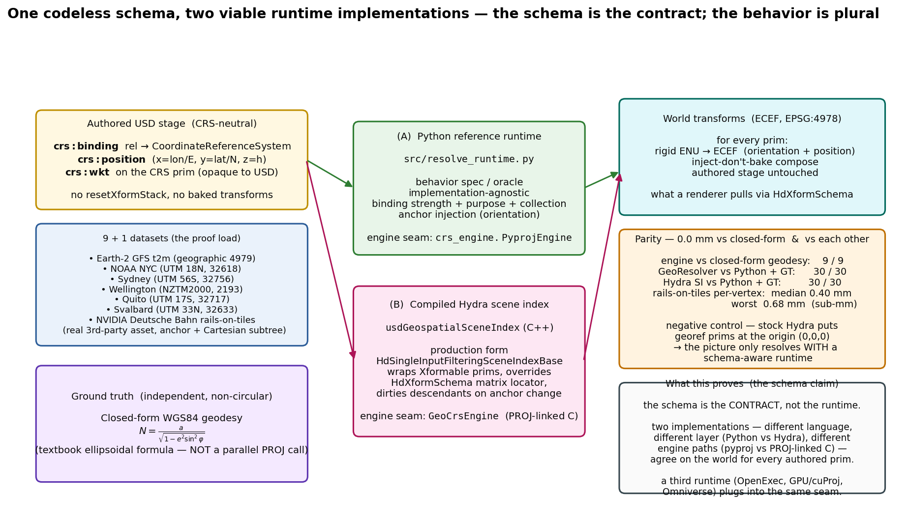

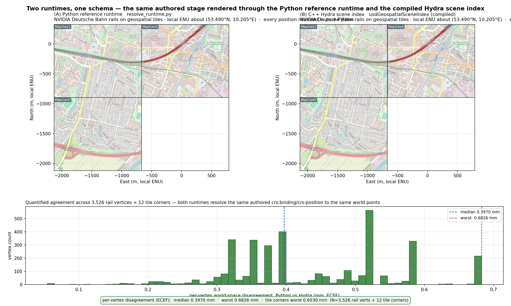

**4 — It just works in usdview (real Hydra Storm render).** Beyond the plots: with only the built
plugins on `PXR_PLUGINPATH_NAME` — **no application code, no hand-built scene-index chain** —
opening the georef scene in **usdview** (or `usdrecord`) draws the railway at its correct
ECEF position via Storm. The `crs:` data flows through Hydra and an auto-inserted scene index
resolves it. This is a *real renderer image*, not a plot.

<!-- slide:image src="docs/railway_storm_autoinsert.png" eyebrow="Proof · real render, auto-insert" title="It just works in usdview (Storm)" caption="Real Hydra Storm render (not a plot): with the plugin on the path, the railway auto-resolves at its ECEF position — no app code. Negative control (plugin removed): railway absent. The auto-insert path matches the oracle 30/30 at 0.0 mm (testHydraAutoParity)." -->

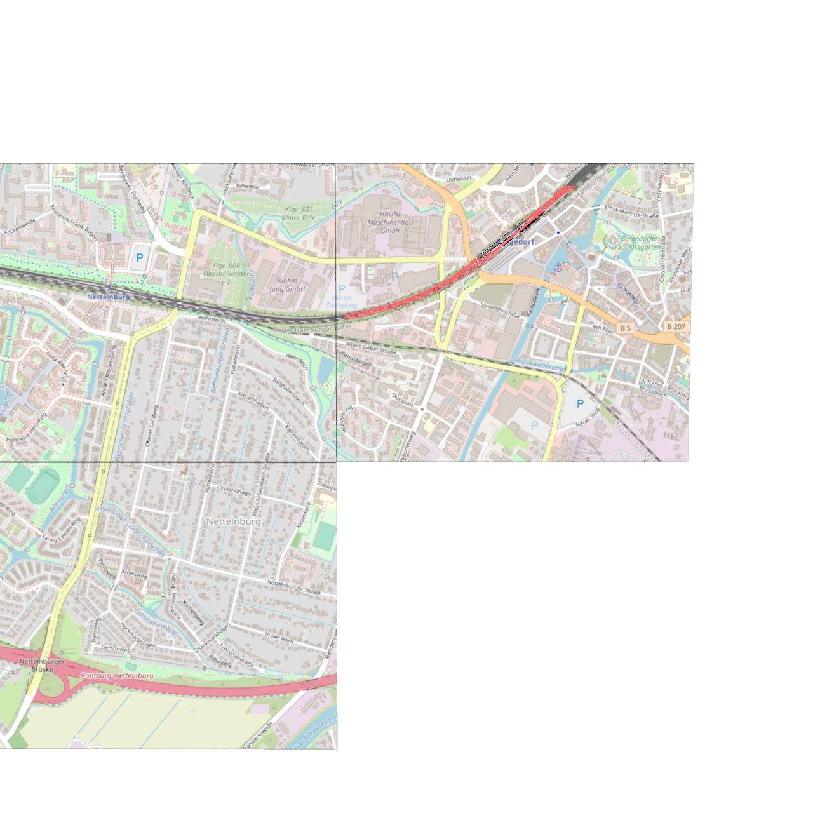

How it works: `crs:` properties are custom attrs/rel on a codeless schema, so they are absent from
the default Hydra stream. A **keyless `UsdImagingAPISchemaAdapter`** (`apiSchemaName ""`, modeled on
`coordSysAPIAdapter` and NVIDIA's `omniGeoSceneIndex`) surfaces `crs:position`/`crs:binding`/
`crs:wkt` *into* Hydra for every prim; the scene index resolves entirely from the Hydra data
stream. *Scope note (stated, not hidden):* the auto path resolves **direct** `crs:binding`
(+ nearest / stronger); collection- and purpose-based strength are resolved via the stage path — the
neutral railway / earth2 scenes use direct bindings, which is what auto-insert exercises. The resolver
is thread-safe: its `UsdGeomXformCache` is mutex-guarded, so Storm can sync rprims across TBB threads
without a double-free.

## The design call: resolve, don't bake

<!-- slide:section title="The design call" subtitle="Resolve at runtime; keep the authored scene coordinate-neutral." -->

The central decision: **`crs:binding` is a relationship, resolved at runtime — not
references-as-binding, not a baked `resetXformStack`.** The authored scene stays
coordinate-neutral; a runtime reprojects `crs:position` into the target CRS and composes ancestor
transforms. This answers the question the earlier geospatial-in-USD effort stalled on: how do
georeferenced transforms reconcile with the pre-existing `UsdGeomXformable` stack — *replace* it,
*wrap* it, or *coexist*? Baking a `resetXformStack` answers "replace," at the cost of a non-neutral
scene and lost composability. This schema answers **"coexist," via a runtime-injected anchor — and
demonstrates it rather than arguing it.**

<!-- slide:text eyebrow="Replace · wrap · or coexist?" title="Resolve, don't bake" body="`crs:binding` is a relationship resolved at runtime — not references-as-binding, not a baked `resetXformStack`. | The authored scene stays coordinate-neutral; a runtime reprojects and composes ancestor transforms. | This is the question the earlier effort stalled on — replace, wrap, or coexist with the `UsdGeomXformable` stack? The answer here is **coexist**. | Proven, not argued: the baked Esri scene and our neutral scene land the same corner to 0.0 mm." -->

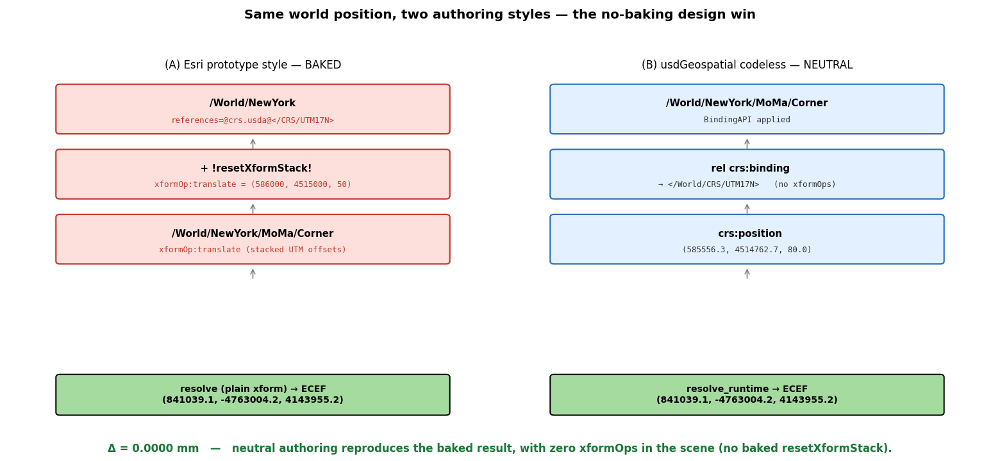

`src/testenv_equivalence.py` rebuilds the Esri prototype's New York / MoMA scene two ways — the
baked `resetXformStack` + stacked `xformOp:translate`, and our neutral `crs:binding` +
`crs:position` — and the building corner lands at the **same ECEF point to 0.0 mm**, with the
neutral scene carrying **no xformOps at all** (`testenv/world_baked_resetxformstack.usda` vs.
`testenv/world_neutral_relbinding.usda`).

**Where `resetXformStack` lives is the whole point.** The compiled Hydra scene index *does* set
`resetXformStack = true` on the xform it injects — which can look like the very thing this design
rejects. It is not. What the design rejects is `resetXformStack` **authored into a layer** (every
downstream consumer then inherits it and the scene is no longer coordinate-neutral). In the scene
index, the flag sits on a **computed, transient Hydra data source**, never written into the
authored scene: the resolver has already composed ancestor transforms and returns the prim's full
world (ECEF) matrix, so the flag only tells Hydra *not to re-compose that matrix under its parents*
at flatten time. The authored stage carries **zero `resetXformStack` and zero `xformOp`** — only
`crs:` properties (read `testenv/world_neutral_relbinding.usda` directly).

**Alignment with the Esri prototype.** The schema library is name- and layout-aligned with the Esri
C++ prototype — same library path `pxr/usd/usdGeospatial/`, same prims, same properties — so a
reviewer who knows one reads the other. The one difference is exactly the design call above: the
Esri branch is a C++ typed schema whose `Bind()` *bakes* a `resetXformStack`; this variant is
codeless and resolves the binding at runtime.

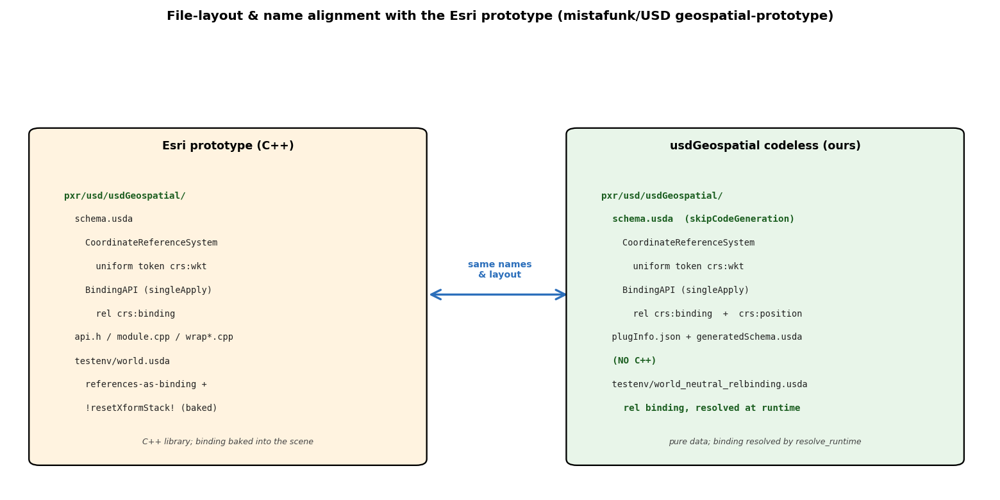

**Binding semantics — full MaterialBindingAPI parity.** Resolution rules mirror
`UsdShadeMaterialBindingAPI`: **strength** (`bindCRSAs` = weaker / strongerThanDescendants),
**purpose** (`crs:binding:<purpose>`), and **collection** (`crs:binding:collection:...`, where a
collection binding beats a direct binding at the same prim). The precedence ladder below is read
*live* from `resolve_runtime.crs_of_prim`; the figure self-asserts it equals the resolver, so it
cannot drift from the code.


## Coexisting with UsdGeomXformable (inject, don't bake)

<!-- slide:text eyebrow="Coexisting with UsdGeomXformable" title="Anchor injection: inject, don't bake" body="A georeferenced anchor with an ordinary Cartesian subtree (a building in local metres) — children have no `crs:position`. | The runtime injects the anchor's rigid local-frame→ECEF basis (full ENU orientation) at resolve time. | The subtree then composes under it **as ordinary `UsdGeomXformable`** — nothing baked into the layer. | `resetXformStack` lives only on a transient, computed Hydra data source, never the authored scene." -->

The design above handles georeferenced *leaves* (each prim carries its own `crs:position`). The
harder case — the one stock USD gets wrong — is a georeferenced **anchor** with an ordinary,
non-georeferenced **Cartesian subtree** (a building modelled in local metres). A plain child has no
`crs:position`, so standard composition renders it **at the world origin** — the anchor's
georeferencing lives in `crs:position`, which the xform stack never reads.

The fix is to **inject** the anchor's frame at runtime, not bake it: the anchor's `crs:position` +
bound CRS define a **rigid local-frame → ECEF transform**, and the subtree composes under it as
ordinary USD.

- **Orientation, not just position.** The injected frame is the full ENU / topocentric basis at the
  anchor (east-north-up), not merely the translated ECEF point. A subtree's local `+Z` must point
  along the *ellipsoidal normal*, which at NYC is ~49° off ECEF `+Z` — a position-only resolver
  lays every asset on its side everywhere but the pole. (`src/crs_engine.py` supplies this basis.)
- **Transient, never written.** Injection happens in a *computed* representation
  (`resolve_runtime.resolve_with_injection`); the authored stage is untouched.
- **Proven against closed-form geodesy** (`src/test_anchor_injection.py`): a building 1000 m E /
  500 m N and a roof +20 m up land to **0.0 mm**; position-only is **410 m** wrong; stock USD
  without injection puts the child **6.4×10⁶ m** off — the origin gap, quantified.
- **Float32 localization falls out for free.** The large magnitude lives in the double-precision
  injected anchor (~6.4×10⁶ m); the asset's vertices stay small float32 *local* offsets.
  `src/test_float32_localization.py` shows absolute-float32 ECEF loses **162 mm** at that magnitude
  while localized float32 keeps **0.0003 mm** — a ~**480,000×** improvement.

Hand-tweaks survive: because we inject-don't-bake, the authored subtree stays clean Cartesian, so a
DCC's native TRS gizmos Just Work on children — a point in favor of coexist over baked-
`resetXformStack`, where hand-edits fight a baked matrix.

### Composition frame: projected vs. geographic anchors (a correctness rule, proven)

<!-- slide:text eyebrow="Compose in the CRS-implied frame" title="Projected vs geographic anchors" body="A GEOGRAPHIC/ECEF anchor's child offsets are local metres → compose through the anchor's true-ENU basis (orientation matters; local +Z = ellipsoidal normal). | A PROJECTED (UTM/State-Plane) anchor's child offsets live in the grid plane → compose IN-PLANE (grid add + reproject), NOT through ENU. | UTM grid axes differ from true ENU by grid-convergence + point-scale — lifting grid offsets through ENU bends them ~4.86 m over a ~420 m lever. | Same neutral authored scene; the runtime picks the frame from the bound CRS type. Proven 0.0 mm both ways against closed-form geodesy." -->

Coexist has one correctness rule the runtime must honor, because it is where a naïve implementation
goes wrong: **compose a child's offsets in the frame its anchor's CRS implies.**

- A **geographic / geocentric (ECEF) anchor** carries child offsets in local metres → compose
  through the anchor's **true-ENU / topocentric basis** (the NYC case above).
- A **projected (UTM, State Plane, …) anchor** carries child offsets in the anchor's **grid plane**
  → compose **in-plane** (add the offset to the anchor's grid coordinates and reproject), **not**
  lifted through ENU. UTM grid axes differ from true ENU by grid convergence + point scale, so
  lifting grid-authored offsets through ENU introduces a real error (~**4.86 m** over a ~420 m
  anchor→corner lever in a UTM-17N-under-UTM-30N test).

The authored scene is identical either way; the runtime selects the frame from the bound CRS type
(`crs_engine.is_projected`). An adversarial head-to-head enforces this rule
(`test_coexist_vs_baked.py`): it rebuilds Simon Haegler's multi-CRS POC scene (MoMA in
NAD83/UTM-17N under a WGS84/UTM-30N anchor) both baked and neutral and measures each against an
independent closed-form pyproj ground truth. Composed in the CRS-implied frame, both approaches land
the corner at the same ECEF point to **0.0 mm**; compose a projected anchor's child through the
true-ENU basis instead of its grid plane and the corner lands 4.86 m off — the test asserts the
frame selection so that error cannot pass silently.

## Non-geometric georeferenced data — visualize by composition, don't bake

<!-- slide:section title="Non-geometric data" subtitle="A common geospatial case: data with no shape. Visualize it with a composition overlay — without touching or duplicating the data." -->
<!-- slide:text eyebrow="A first-class use case" title="Non-geometric georeferenced data" body="Much geospatial data has NO intrinsic shape: scalar fields (temperature, elevation), sensor/telemetry networks, survey benchmarks. In USD it is a prim carrying `crs:position` + a value, no geometry. | Visualization is a CHOICE, not part of the data — so add it via USD COMPOSITION: keep the dataset pristine in a base layer; a separate overlay layer subLayers it and adds marker glyphs as geometry-only `over`s. | ZERO `crs:*` re-authored; the base stays byte-identical; pull the overlay and you are back to pure data. | The glyphs are Cartesian children at each prim's local origin — the auto-inserted scene index places them via the SAME anchor-injection path as any Cartesian subtree. Marker size is a stated DISPLAY parameter (like a scatter's point size), and the overlay can be sparse." -->

A large share of real geospatial data has **no intrinsic shape**: a GFS temperature field, a
sensor/telemetry network, LiDAR-derived measurements, survey benchmarks. In USD that is honestly a
prim carrying `crs:position` (+ a data value like `primvars:t2m`) and **no geometry** — the data is
not a mesh. Visualizing it is a *choice you make to understand non-visual data*, not something the
data *is*. This is a common, first-class use case, and the codeless schema supports it cleanly.

The right way to add a visualization is **USD composition**, not baking geometry into the dataset:

- The **base layer** stays the pristine non-geometric dataset (e.g. `out/earth2_georef.usda`:
  7,320 `crs:position` samples of GFS `t2m`, zero geometry).
- A separate **overlay layer** (`src/visualize_field_glyphs.py` writes `out/earth2_glyphs.usda`)
  `subLayers` the base and adds marker glyphs as **geometry-only `over` prims** — it re-authors
  **zero `crs:*`**. The georeferencing composes down from the base:

```usda
#usda 1.0
(
    subLayers = [
        @earth2_georef.usda@          # the pristine, non-geometric dataset
    ]
)

over "World" { over "GeoSamples" {
    over "p_0_0" {                    # 'over', not 'def' — no crs:* restated, no prim duplicated
        def Points "glyph" {
            point3f[] points = [(0, 0, 0)]   # at the georef prim's LOCAL origin
            float[] widths = [60000]          # a stated DISPLAY parameter (like scatter s=), not a coordinate
            color3f[] primvars:displayColor = [(0.78, 0.69, 0.04)]
        }
    }
}}
```

Because each glyph is a Cartesian child at the georef prim's local origin, the auto-inserted scene
index resolves it through the **same anchor-injection path** proven in `test_anchor_injection.py`
(and used by the railway's Cartesian subtree) — **no new code path**. The base dataset is never
opened for write (byte-identical before/after), the overlay is fully **removable**, and the same
physical data is never **duplicated**. It also doubles as a proof that the codeless schema composes
correctly across USD layers (`subLayers` + `over`).

The payoff shows in the cross-visualizer parity: the *same* non-geometric field, resolved once,
drawn by two independent visualizers — a Matplotlib scatter and a Hydra **Storm** render of the
composed overlay — landing on the same globe. (Glyph coverage differs by construction: Matplotlib's
round `s=` dot vs. Storm's `UsdGeomPoints` marker; the *resolved positions* are identical, the glyph
style is a disclosed display choice.)

<!-- slide:image src="docs/globe_visualizer_parity.png" eyebrow="Two visualizers, one field" title="Same non-geometric data, matplotlib vs Storm" caption="The earth2 GFS t2m field (7,320 crs:position samples, no geometry) visualized two ways: a Matplotlib scatter (left) and a Hydra Storm render of a composition-overlay of marker glyphs (right), placed by the auto-inserted scene index. Same resolved positions; glyph style is a disclosed display choice." -->

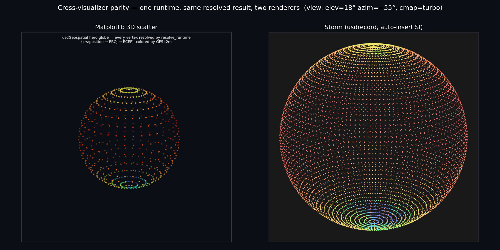

### Same runtime, many CRSs — the anti-overfit position set

<!-- slide:image src="docs/multiCRS_glyph_renders.png" eyebrow="Proof · not overfit" title="One runtime, five CRS families, both hemispheres" caption="Matplotlib plot (not a render): where each locale's authored point resolves in ECEF, through ONE code path — NYC (UTM 18N), Sydney (UTM 56S), Wellington (NZTM2000), Quito (UTM 17S, ~equator), Svalbard (UTM 33N, ~78N). The only thing that changes between locales is the authored EPSG; the five points land 2,200+ km apart on the globe. Verified sub-mm vs closed-form WGS84 geodesy in generalization_suite.py." -->

The numeric no-overfit proof (§[The proofs](#the-proofs)) is broad but stated in *numbers*. The
figure below makes the same point *visible* without inventing geometry: it plots where each
locale's authored point **resolves** in ECEF through **one code path** — lon/lat → the locale's
projected CRS → ECEF, via PROJ (the registered default engine). The five span five CRS families,
both hemispheres, and equator-to-78°N — **NYC** (UTM 18N), **Sydney** (UTM 56S), **Wellington**
(NZTM2000), **Quito** (UTM 17S, ~equator), **Svalbard** (UTM 33N, ~78°N) — and the **only** thing
that differs between them is the authored EPSG. The resolved points land 2,200+ km apart across the
globe (no per-CRS special-casing anywhere), and each is verified sub-mm against closed-form WGS84
geodesy in `generalization_suite.py`.

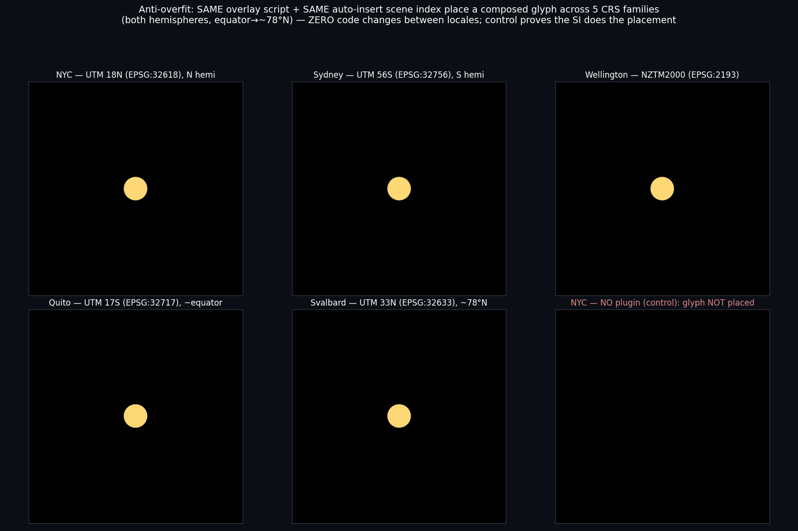

## Guard rails: what "coexist" asks of an asset

<!-- slide:section title="Guard rails" subtitle="Coexist's costs are asset-structure invariants a validator can enforce." -->
<!-- slide:text eyebrow="Enforceable, not showstoppers" title="Guard rails a validator can check" body="Coexist has no architectural showstopper — it matches baking to 0 mm when it composes in the CRS-implied frame. | Its residual costs are a small set of ASSET-STRUCTURE invariants, each mechanically checkable. | (1) anchor-vs-child is unambiguous; (2) child offsets are authored in the frame the bound CRS implies; (3) a CRS-requiring stage declares it so unaware consumers detect-and-refuse. | A neutral authored scene PRESERVES the semantic info a validator needs; a baked scene has already collapsed CRS intent into a matrix." -->

The honest shape of "coexist" is that it is **not** blocked by any
architectural showstopper — it reproduces the baked approach to 0.0 mm when it composes in the
CRS-implied frame. Its residual costs are a small set of **asset-structure invariants**, and the
important property is that **each is mechanically checkable by a validator** — the same conformance
posture USD already uses for `UsdShade` bindings, `UsdSkel`, and core-spec rules. A neutral authored
scene keeps `crs:binding` + `crs:position` **inspectable**, so a validator can check these against
the declared CRS; a baked scene has already collapsed CRS intent into a matrix. `verify.py` is the
runnable validator today; a codeless, `usdchecker`-discoverable validator **plugin is a near-term
deliverable, not just a roadmap item** — it is what turns these guard rails from
*detectable-in-principle* into *detected-in-practice* in an ordinary `usdchecker` run, and it is the
mechanism that makes the coexist tradeoff (below) safe.

> **The tradeoff we are making with eyes open.** Coexist deliberately gives up the "open the stage
> and it just works" property *for a CRS-unaware consumer*: such a consumer sees a coordinate-neutral
> scene and, without the resolver, places prims wrong. We accept this because the alternative is
> worse. Baking *looks* like "just works," but its failure mode is **silent and unrecoverable** — the
> CRS intent is already collapsed into a matrix, so a wrong or mismatched assumption cannot be
> detected or undone. Coexist's failure mode is **loud and recoverable**: the `requires-CRS` marker
> (G3) + the `usdchecker` validator let an unaware consumer *detect and refuse* rather than
> mis-place, and the authored scene still carries the CRS intent a validator (or a later resolver)
> can act on. Loud-and-recoverable over silent-and-unrecoverable is the whole trade.

`src/test_illformed_assets.py` authors a deliberately **ill-formed asset** for each guard rail,
shows the concrete failure against independent closed-form geodesy, then shows the **minimal
authoring fix** and re-measures (figures by `src/render_illformed.py`; left = broken, right =
fixed).

<!-- slide:image src="docs/illformed_gallery.png" eyebrow="Broken → fixed, measured" title="What breaks in coexist, and the fix" caption="G1 anchor-vs-child 418.9 m → 0 mm · G2 wrong frame 4.86 m → 0 mm · G3 no marker 6,369 km silent → detect-and-refuse" -->

1. **G1 — anchor-vs-child ambiguity.** *Broken:* `/World/NewYork/MoMa/Corner` authored with its
   **own** `crs:binding` + `crs:position` (as if an independent georeferenced leaf) and parented
   under the building expecting relative placement — it jumps to its own CRS point, **418.9 m** off.
   *Fix:* delete the corner's binding/position and author it as an ordinary Cartesian child
   (`double3 xformOp:translate = (50, 100, 30)`) → **0.000 mm**. *Validator:* `verify.py` check
   **A2** flags a georef prim that also bakes an xformOp; a `crs:position`-under-`crs:position`
   nesting without an override binding is the smell.

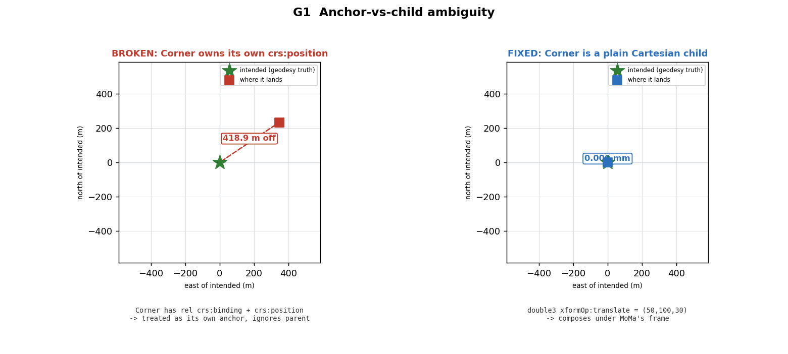

2. **G2 — wrong composition frame.** *Broken:* a **projected** (UTM-17N) anchor's child offsets
   composed through the anchor's **true-ENU** basis. Grid convergence + point-scale bend them
   **4.86 m** over a ~418 m lever. *Fix:* compose the offset **in the grid plane** and reproject →
   **0.000 mm**. *Validator:* the runtime selects the frame from the bound CRS type
   (`crs_engine.is_projected`); a validator asserts the two agree.

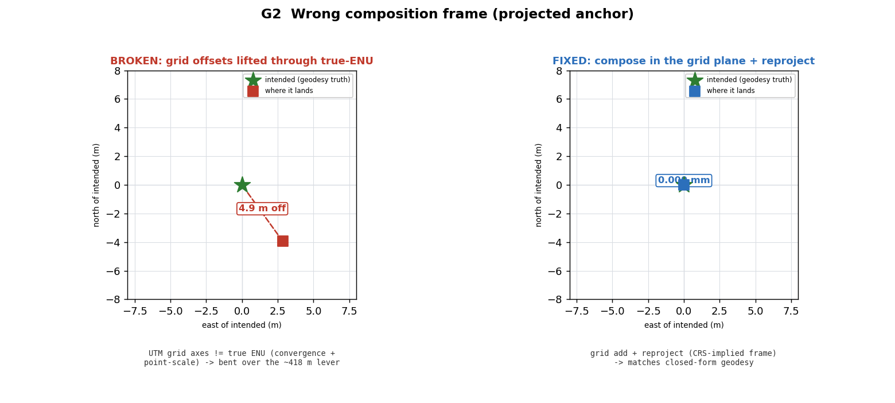

3. **G3 — no requires-CRS marker.** *Broken:* a coexist scene with no stage marker, opened by a
   **CRS-unaware** consumer (plain `UsdGeom.XformCache`, no resolver), silently places the building
   at its bare local offset — **6,369 km** from truth, with no error. *Fix:* stamp
   `customLayerData['crsResolutionRequired'] = true`; a conformant consumer detects it and
   **refuses / defers** to a resolver. *Validator:* `verify.py` check **G** fails any stage that
   carries `crs:binding` without the marker.

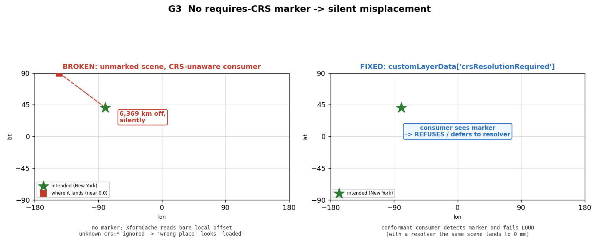

**On the requires-CRS marker: expect pushback (and a layer-vs-prim debate).**

<!-- slide:text eyebrow="Anticipated debate" title="The marker: a tradeoff worth having" body="A 'requires-CRS' marker is the honest cost of coordinate-neutral coexist: it is what lets an unaware consumer fail LOUD instead of silently misplacing. | Expect pushback — it adds a discovery obligation, and a non-conformant consumer still ignores it (it is a contract, not an enforcement). | If embraced, the next debate is WHERE it lives: layer metadata (customLayerData) vs a prim-level applied schema. | Our lean: a stage/layer-level signal for cheap detect-and-refuse, optionally refined per-prim; but this is squarely a WG call." -->

- **Why it exists.** Coordinate-neutral authoring preserves composability and keeps the scene
  inspectable, but it is also what makes a CRS-unaware consumer misplace content silently (G3). The
  marker is the price of neutrality: a cheap signal that lets such a consumer **detect-and-refuse**
  rather than render 6,000 km off. The baked approach doesn't need it — but pays instead with a
  non-neutral scene and an *even worse* silent failure (the head-to-head measured ~6.4×10⁶ m for
  neutral vs ~1.0×10⁷ m for baked when a grid `xformOp` is misread as ECEF).
- **The fair objections.** It adds a discovery obligation to every conformant consumer; a
  *non*-conformant consumer still ignores it (a marker is a **contract, not enforcement**); and it
  is one more thing an author can forget — hence the `verify.py` **G** check, caught at authoring
  time, not render time.
- **The layer-vs-prim question.** Even if accepted, *where* it lives is a genuine debate: **layer /
  stage metadata** (`customLayerData['crsResolutionRequired']`, used here) is one cheap O(1) lookup
  before traversal, but coarse and free-form; a **prim-level applied schema** is typed, validatable,
  and local, but a consumer must traverse to discover it. **Our lean (a WG call, not a decree):** a
  stage/layer-level signal for the cheap up-front check, optionally refined by prim-level typing
  where per-subtree granularity matters. We implemented the layer-metadata form; the prim-schema
  form is a small addition.

## Runtimes, tests, and running

<!-- slide:section title="One schema, two runtimes" subtitle="The schema is the contract; the behavior is plural." -->

**Two runtimes, one schema.** The Python runtime is the behavior **contract**; the point of a
codeless schema is that the contract is data, so any number of runtimes resolve the same authored
stage and must land on the same world. The two ship together and share *nothing* but the schema:

- **(A) Python reference** — `src/resolve_runtime.py`, the oracle, projecting via
  `crs_engine.PyprojEngine` (pyproj / PROJ). Traverses bindings (inheritance, strength, purpose,
  collection), reprojects, composes ancestor Cartesian transforms, and (for anchors) injects the
  rigid local-frame → ECEF transform — without touching the authored xform stack. The
  **projection engine is a registration seam** (`src/crs_engine.py`): PROJ / pyproj is the
  *default* registered engine; a deployment could register a GPU engine (e.g. cuProj). WKT stays
  **opaque to USD** — only the engine consumes it.
- **(B) Compiled Hydra scene index** — `../usdGeospatialSceneIndex` (C++), an
  `HdSingleInputFilteringSceneIndexBase` that wraps `Xformable` prims, overrides the `HdXformSchema`
  matrix locator a renderer pulls, and dirties descendants on anchor change — projecting via a
  PROJ-linked C engine (`GeoCrsEngine`). Different language, pipeline layer, and engine binding; it
  auto-inserts into usdview (§[The proofs](#the-proofs)).

<!-- slide:image src="docs/runtime_parity.png" eyebrow="Proof · sub-mm parity" title="Same stage, two runtimes, quantified" caption="Matplotlib plot: Python vs Hydra transforms on the same authored railway stage — 3,526 rail vertices + tile corners agree to median 0.40 mm, worst 0.68 mm. fig_runtime_parity.py fails the build if disagreement exceeds 1 mm." -->

The takeaway is the schema claim itself: **the schema is the contract; the behavior is plural.** A
third runtime (OpenExec, a GPU / cuProj engine, an Omniverse runtime) plugs into the same seam and
is held to the same oracle.

### Where the Python reference runtime sits (no exact precedent — by design)

<!-- slide:text eyebrow="No exact precedent — by design" title="Where the Python reference runtime sits" body="It's the codeless schema's **conformance oracle** — 'given this stage, where does each prim end up?' — pinned to closed-form geodesy, that compliant implementations should match. | NOT the specification: the normative behavior belongs in **prose** (proposed into the Esri proposal); the Python is the oracle that expresses it, not the source of truth. | NOT proposed for USD core, NOT a runtime dependency, NOT Python-in-the-render-loop, NOT the prescribed consumer. | Precedent: AOUSD's core-spec-supplemental — Python sample impls + a compliance framework, spec normative and impl illustrative — is exactly this shape." -->

Because the schema is **codeless**, the resolution behavior must live *somewhere* outside the
schema. That behavior is **normative as prose** (what we propose to write into the Esri proposal);
`resolve_runtime.py` is that same contract written down once in the most readable *runnable* form:
a pure-Python, dependency-light **conformance oracle** — pinned to closed-form geodesy — for "given
this authored stage, where does each prim end up?" It is a *conformance oracle, not the
specification*: compliant implementations should **match its output**, but the source of truth is
the prose contract, not the Python. (Note this is separable from codelessness — a *typed* schema
would need the same behavior contract; codeless just makes it unavoidable to state one.) It is
**not** proposed for USD core, **not** a runtime
dependency, **not** Python-in-the-render-loop, and **not** the prescribed way to consume the schema.
A real consumer (Hydra scene index, OpenExec, an Omniverse / native runtime, a GPU cuProj path)
implements the same contract in its own setting — the Python is the *oracle they conform to*.

There isn't a clean precedent for this exact artifact *in the OpenUSD repo* — but there is one right
next door. OpenUSD already ships reference/example code
in Python under `extras/usd/examples/` (`usdSchemaExamples`, `usdResolverExample`, …); and **AOUSD's
`core-spec-supplemental`** is precisely this shape — Python sample implementations plus a compliance
framework, with the **spec normative and the implementation illustrative**. We follow that model:
a runnable **conformance oracle** for a codeless schema whose behavior is deliberately external, with
the normative statement living in prose. That placement is a deliberate design choice, and one we'd
specifically like the working group's read on.

### Tests — all green, all with teeth

Every test is openable and runnable; each has a real negative control or an independent ground truth.

- `verify.py` — the runnable validator: confirms the schema is truthfully codeless (`crs:*` with
  `custom=False` resolve as schema-defined), plus authoring checks (incl. the G marker).
- `multi_crs_example.py` — negative control: ignoring bindings diverges >100 km.
- `test_ancestor_compose.py` — ancestor-transform composition; negative control diverges ~7,482 km.
- `test_binding_semantics.py` / `test_binding_composition.py` — MaterialBinding-style precedence
  (strength, purpose, collection) and cross-layer / list-edit composition.
- `test_dynamic_crs.py` / `test_grid_files.py` — dynamic-CRS (`crs:epoch`) and external PROJ grids.
- `test_anchor_injection.py` — georef anchor + Cartesian subtree lands & orients to 0.0 mm;
  position-only 410 m wrong; stock USD 6.4×10⁶ m off.
- `test_float32_localization.py` — localized float32 ~480,000× more precise than absolute float32.
- `test_coexist_vs_baked.py` — neutral reproduces the baked approach to 0.0 mm; found the
  projected-anchor composition rule.
- `test_illformed_assets.py` — G1/G2/G3 broken→fixed, each measured against closed-form geodesy.
- `generalization_suite.py` — 7 diverse datasets (incl. the real NVIDIA railway), all sub-mm.
- `testenv_equivalence.py` — design equivalence vs the baked-`resetXformStack` scene (0.0 mm,
  neutral scene has zero xformOps).
- `render_figures.py` — the coherence figure self-asserts sub-mm co-registration; `fig_runtime_parity`
  fails the build if Python-vs-Hydra disagreement exceeds 1 mm.
- `../usdGeospatialSceneIndex/run_parity.sh` — the compiled C++ scene index: CRS engine 9/9, stage
  resolver 30/30, Hydra SI via `HdXformSchema` 30/30 — all 0.0 mm; negative control: stock Hydra
  puts georef prims at the origin. `testHydraAutoParity` adds the stage-free auto-insert path (30/30).
- `pxr/usd/usdGeospatial/regen-schema.sh --check` — schema resources are in sync.

### Running — two paths

**The codeless Python path (no external renderer):**

```bash
source <repo>/.venv/bin/activate        # usd-core 26.5, pyproj 3.7.1 (PROJ 9.5.1)
cd extras/usd/examples/usdGeospatial
python3 src/reencode_georef.py --stride 40 --out out/earth2_georef.usda
python3 src/verify.py out/earth2_georef.usda
python3 src/testenv_equivalence.py
python3 src/test_anchor_injection.py    # georef anchor + Cartesian subtree (inject-don't-bake)
python3 src/generalization_suite.py     # 7 diverse datasets vs closed-form geodesy (no overfit)
python3 src/fig_multicrs_positions.py   # anti-overfit figure: 5 CRS families resolve to distinct ECEF (one code path)
python3 src/render_figures.py           # regenerate the Python-reference figures into docs/
```

`render_figures.py` regenerates the nine Python-reference figures; it also produces
`multi_runtime.png` / `runtime_parity.png` **if** the compiled C++ Hydra binary is already built,
otherwise it skips those two with a clear note.

**The full two-runtime parity proof (needs a prebuilt USD):**

```bash
USD_INST=/path/to/usd/inst ../usdGeospatialSceneIndex/run_parity.sh
```

See `../usdGeospatialSceneIndex/README.md` for the full build environment, and the same directory's
notes for reproducing the auto-insert usdview / usdrecord render.

## Status, scope, and open questions

<!-- slide:section title="Open questions" subtitle="What we'd most like the working group's read on." -->

**Status.** This is the **OpenUSD-side, codeless** reference: a pure-data schema plus a Python
reference runtime and a compiled C++ Hydra scene-index runtime (an illustrative consumer, modeled on
the Gaussian-splat example — not a prescribed production renderer). The Esri C++ typed schema
remains the parallel artifact; this bundle backs the proposal's design calls (binding shape, no
baked `resetXformStack`, resolution-rule parity) with running code on a real dataset. It
demonstrates: anchor injection (the coexist answer); a head-to-head against the baked approach in
which neutral reproduces it to 0.0 mm, hand-TRS edits survive, and neutral resolve costs
~1.8 ms/prim; the compiled Hydra scene-index form with auto-insert into usdview; and the
projection-engine seam.

**Committed near-term (not in this drop, but next):** the codeless `usdchecker`-discoverable
validator plugin (`verify.py` is the runnable validator today) — it is what makes the coexist
tradeoff safe in practice, so we are treating it as a deliverable rather than a maybe.

**Out of scope here (need other resources):** a draped raster / terrain basemap for the coherence
figure (`cartopy` + a DEM asset); an end-to-end grid-*applied* transform (GDAL + a bundled PROJ
grid); an OpenExec / GPU-cuProj *third* runtime.

<!-- slide:text eyebrow="For the working group" title="Open design questions" body="1. Is 'codeless schema + a runnable reference runtime as the behavior contract' the right shape — and where should that reference ultimately live? | 2. Is **coexist** the right relationship to `UsdGeomXformable` (neutral scene + runtime reconciliation) — versus hooking CRS resolution into `Xformable` directly? Given the head-to-head parity + the guard-rail set, is the residual validation surface acceptable to standardize?" -->

**Open design questions for the working group** — the two calls we'd most like Esri's / the WG's
read on:

1. **Is "codeless schema + a runnable reference runtime as the behavior contract" the right shape**,
   and where should that reference ultimately live (an `extras/usd/examples` module, a separate
   conformance suite, prose in the spec)?
2. **Is "coexist" the right relationship to `UsdGeomXformable`** — a coordinate-neutral authored
   scene plus runtime reconciliation — versus hooking CRS resolution into `Xformable` directly? The
   head-to-head shows neutral **reproduces the baked approach to 0.0 mm** on a real multi-CRS
   scene, so the question is not "does coexist work?" but **"is the residual guard-rail set
   (anchor-vs-child, compose-in-CRS-frame, requires-CRS marker) an acceptable conformance surface to
   standardize?"**

<!-- slide:section title="What we need from you" subtitle="Concrete asks so the next iteration is grounded in your workflows, not our guesses." -->
<!-- slide:text eyebrow="Asks" title="What we need from you" body="1. The Redlands BIM prototype scene + its validation script, so we can add a second real, contributor-authored case beside the multi-CRS POC. | 2. Confirmation / correction of the driving workflows: which of AECO site placement, multi-source GIS twins, multi-zone infrastructure, and geodetic sim must 'coexist' survive first? | 3. A read on the guard-rail set as a conformance surface (anchor-vs-child, compose-in-CRS-frame, a 'requires-CRS' stage marker + detect-and-refuse) — which we intend to enforce via a committed codeless `usdchecker` validator plugin. | 4. Where the reference runtime should live, and whether to lift the 'resetXformStack' *semantic* out of the authored-layer text into a documented behavior contract multiple runtimes honor." -->

**What we'd ask of Esri and co-collaborators**, to make the next iteration concrete:

1. **The Redlands BIM prototype scene** (BIM-model-at-site scene + Python validation script) so we
   can validate the AECO site-placement workflow directly, not by proxy.
2. **Confirmation (or correction) of the driving workflows** — AECO/BIM, GIS & digital twins,
   infrastructure across coordinate zones, defense/simulation: which must *coexist* survive first,
   and what edit/authoring workflows (hand-placement, relocation, moving anchors, dynamic datums)
   should we be exercising?
3. **A read on the guard-rail set as a conformance surface** (anchor-vs-child, compose-in-CRS-frame,
   requires-CRS marker + detect-and-refuse). We intend to ship a codeless `usdchecker`-discoverable
   validator plugin as the enforcement mechanism — a read on the guard-rail set *as the thing that
   plugin should check* is what we most want.
4. **Where the reference runtime should live**, and whether to jointly **lift the `resetXformStack`
   *semantic* out of the authored-layer text** into a documented behavior contract multiple runtimes
   honor. To be precise: we are *not* rejecting `resetXformStack` as a semantic — both runtimes here
   honor it (Hydra sets it on a transient computed data source; the Python resolver composes the
   equivalent fresh-basis behavior implicitly at each anchor). What we decline is *baking it into
   the authored scene*, because that is what spends composability.
