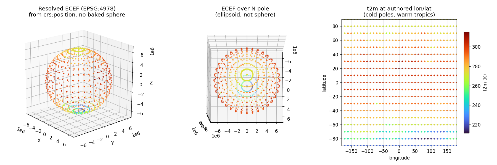
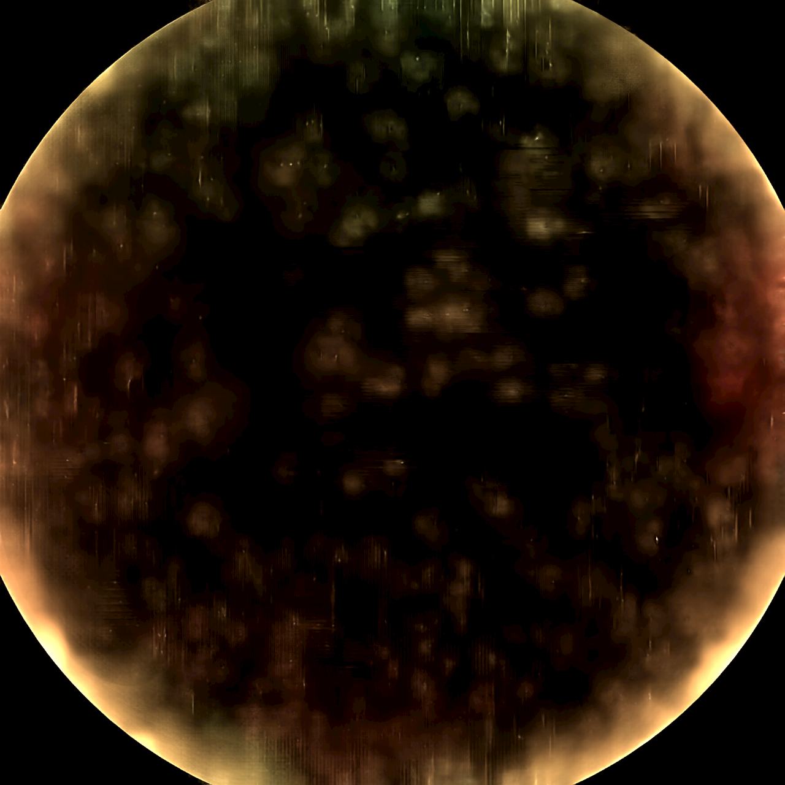
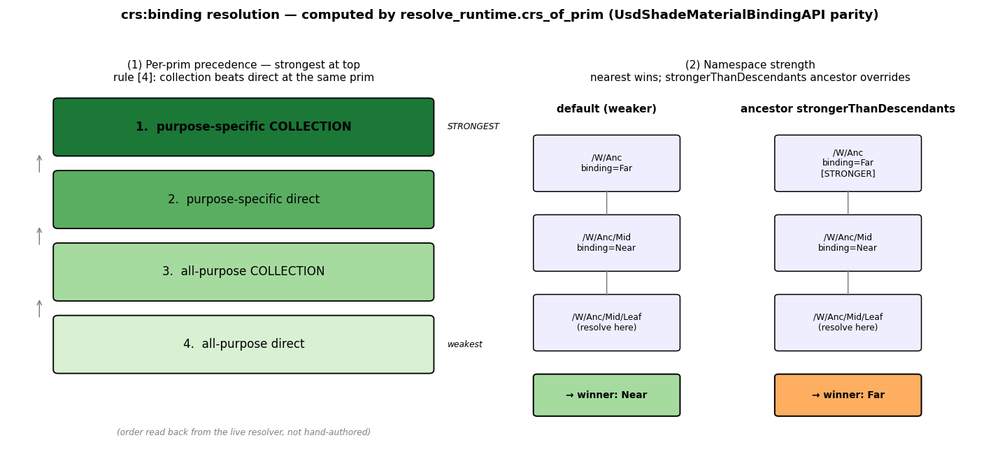

# usdGeospatial — codeless CRS schema + reference runtime (Earth-2 proof point)

A **Gaussians-shaped bundle** for landing geospatial Coordinate Reference System
(CRS) support in OpenUSD: a minimal declarative schema, a reference runtime that
interprets it, an Earth-2 data converter, and docs — built to slot alongside the
**Esri AOUSD AECO Interest Group CRS proposal**.

> The landed Gaussian/particleField work shipped *schema + sample Hydra renderer +
> data converter + docs together*, with the schema as pure data and all runtime
> behavior in `extras/imaging/examples/hdParticleField`. This bundle mirrors that
> shape for geospatial.

## Layout (aligned with the Esri prototype)

The schema library is **file-layout- and name-aligned** with Simon Haegler's (Esri)
prototype on `mistafunk/USD` branch `geospatial-prototype` so it reads as the same
proposal artifact:

```
pxr/usd/usdGeospatial/                 # the schema library
  schema.usda                          # SOURCE (codeless)
  plugInfo.json  resources/generatedSchema.usda   # generated registry
  regen-schema.sh                      # regenerate without a full USD build
extras/usd/examples/usdGeospatial/     # the reference runtime + converter + tests
  src/  docs/  testenv/  data/
```

**Difference from the Esri branch:** that branch is a C++ typed schema whose
`Bind()` writes a baked `resetXformStack` and uses references-as-binding. This
variant is **codeless** (no C++ build) and takes the opposite, neutral-authoring
design (below). The prim and property names match (`CoordinateReferenceSystem`,
`crs:wkt`/`wellKnownText`, `BindingAPI`, `crs:binding`).

## The schema (pure data)

- **`CoordinateReferenceSystem`** (typed): `crs:wkt` (OGC WKT2, authoritative)
  plus optional `crs:epsg`, `crs:displayName`, `crs:epoch` (dynamic CRS),
  `crs:gridFiles` (external PROJ grids).
- **`BindingAPI`** (single-apply, `canOnlyApplyTo Xformable`): `crs:position`
  (always `(lon/E, lat/N, h)`) + `rel crs:binding` → a `CoordinateReferenceSystem`.

Codeless ⇒ `usdGenSchema` emits only `generatedSchema.usda` + `plugInfo.json`; USD
loads the typed prim + applied API from those, so `crs:*` authored with
`custom=False` are **truthfully** schema-defined (verified in `verify.py`).

## Design positions (demonstrated with running code)

1. **Binding is a relationship, resolved at runtime — not references-as-binding,
   not a baked `resetXformStack`.** The authored scene stays coordinate-neutral; a
   runtime resolver reprojects `crs:position` into the target CRS and composes
   ancestor transforms.
   *Proof:* `src/testenv_equivalence.py` rebuilds the Esri prototype's New York /
   MoMA scene two ways — Simon's baked `!resetXformStack!` + `xformOp:translate`,
   and our neutral `crs:binding` + `crs:position` — and shows the building corner
   lands at the **same ECEF point to 0.0 mm**, with the neutral scene carrying no
   xformOps at all. See `testenv/world_baked_resetxformstack.usda` vs.
   `testenv/world_neutral_relbinding.usda`.
2. **Resolution rules mirror `UsdShadeMaterialBindingAPI`** — strength
   (`bindCRSAs` = weaker/strongerThanDescendants), purpose
   (`crs:binding:<purpose>`), and collection (`crs:binding:collection:...`, where a
   collection binding beats a direct binding at the same prim, rule [4]).

## Reference runtime + converter

- `src/reencode_georef.py` — converts the OSS Earth-2 / GFS `t2m` field into a
  **georeferenced** USD (real WKT CRS + `crs:position`), not a baked radius-100
  sphere. Two authoring paths (didactic + `Sdf` batch) produce **byte-identical**
  output.
- `src/resolve_runtime.py` — the CRS-aware runtime: traverses bindings
  (inheritance, strength, purpose, collection), reprojects via PROJ/pyproj,
  composes ancestor Cartesian transforms — without touching the authored xform
  stack.
- `src/render_globe_ovrtx.py` / `render_evidence.py` / `render_binding_semantics.py`
  — visual evidence (see below).

## Evidence





- **evidence.png** — resolved ECEF geometry shows WGS84 flattening (a vs b) → a true
  georeferenced Earth, not a baked sphere.
- **globe_render.png** — RTX path-traced hero globe; every vertex came through the
  `crs:position` → ECEF pipeline.
- **binding_semantics.png** — `crs:binding` precedence + namespace strength, rendered
  live from the resolver (cannot drift from code).

## Tests (all green, all with teeth)

`verify.py` A–F · `multi_crs_example.py` (negative control) ·
`test_ancestor_compose.py` · `test_binding_semantics.py` ·
`test_binding_composition.py` (cross-layer + list-edit) · `test_dynamic_crs.py` ·
`test_grid_files.py` · `testenv_equivalence.py` (design equivalence vs. Esri scene) ·
`../../../../pxr/usd/usdGeospatial/regen-schema.sh --check` (schema in sync).

## Running

```bash
source <repo>/.venv/bin/activate        # usd-core 26.5, pyproj (PROJ 9.5.1)
cd extras/usd/examples/usdGeospatial
python3 src/reencode_georef.py --stride 40 --out out/earth2_georef.usda
python3 src/verify.py out/earth2_georef.usda
python3 src/testenv_equivalence.py
```

## Status / open

- This is the **OpenUSD-side, codeless, Python-runtime** reference. The Esri C++
  typed schema remains the parallel artifact; this bundle backs the proposal's
  design calls (binding shape, no baked resetXformStack, resolution-rule parity)
  with running code on a real dataset.
- Out of scope here (need other resources): a compiled `usdchecker`-discoverable
  validator plugin (C++); an end-to-end grid-*applied* transform (GDAL + a real
  PROJ grid); the parallel **NanoUSD** implementation.
