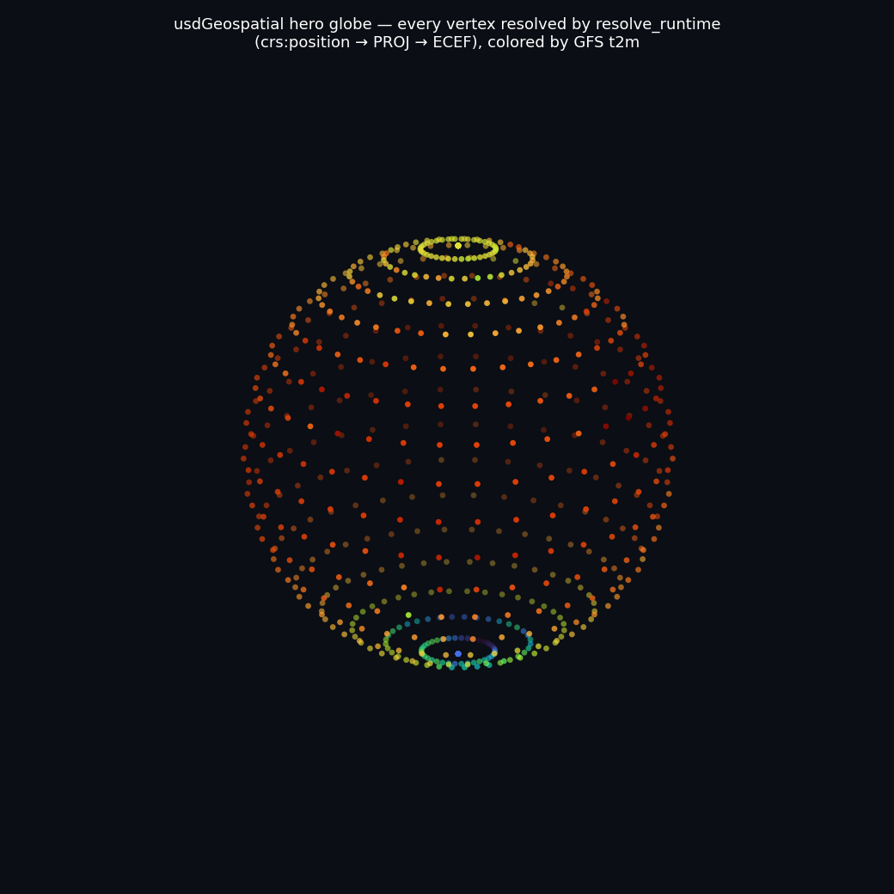
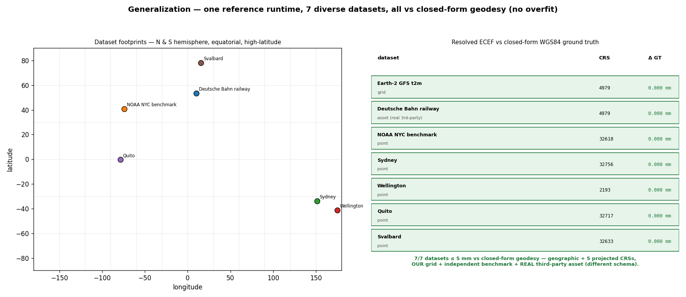
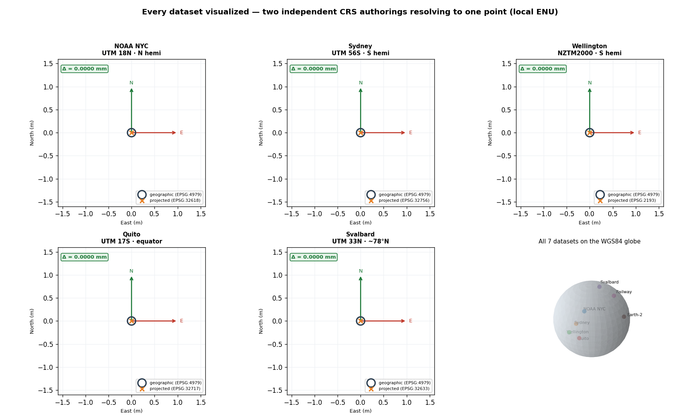

# usdGeospatial — a codeless CRS schema for OpenUSD, proven by two runtimes

A **codeless** geospatial Coordinate Reference System (CRS) schema for OpenUSD. The schema
is a pure **data contract** — not tied to any one implementation. We prove that by shipping
**two independent runtimes** that resolve the *same* authored scene to the *same* world
(Earth-Centered, Earth-Fixed / ECEF) and **agree to sub-millimetre**: a **Python reference
runtime** and a compiled **C++ Hydra scene-index plugin**. The schema is file- and
name-aligned with **Simon Haegler's (Esri) `geospatial-prototype`**, so the two read as the
*same* proposal artifact, with one deliberate design difference: **binding is resolved at
runtime, not baked into the scene.**

A note on reproducibility up front, because it matters for review: most figures here are
regenerated by the codeless **Python** build with one command and no external renderer. Two
figures (`docs/multi_runtime.png`, `docs/runtime_parity.png`) are the cross-runtime parity
visuals and additionally require building and running the compiled **C++ Hydra** scene
index. Both paths are spelled out exactly in [Running](#running).

<!-- slide:title subtitle="a codeless CRS schema for OpenUSD, proven by two runtimes" -->

## What it is (and what it lands like)
<!-- slide:text eyebrow="The proposal" title="A codeless geospatial CRS schema" body="Pure-data schema: a CRS prim + a binding API, skipCodeGeneration=true (no compiled types). | All resolution behavior lives in the example runtimes, not the schema. | Same shape as the landed Gaussian / particleField contribution: schema + sample runtime(s) + converter + docs. | Runtimes here: Python `resolve_runtime.py` and a C++ Hydra scene index." -->

This mirrors the shape of the landed OpenUSD Gaussian / particleField contribution —
*schema + sample runtime(s) + data converter + docs, shipped together*, with the schema as
pure data and all runtime behavior in the example(s). Here the schema is `usdGeospatial`
(codeless), the runtimes are the Python `resolve_runtime.py` and the C++ Hydra scene index,
and the dataset is real OSS Earth-2 / GFS `t2m`.

## Repository layout

Two sibling directories, one schema:

- **`usdGeospatial/`** (this directory) — the codeless schema, the **Python reference
  runtime** (`src/resolve_runtime.py`), the Earth-2 data converter, the test suite, and the
  figures.
- **`../usdGeospatialSceneIndex/`** — the compiled **C++ Hydra scene-index plugin**, a second,
  illustrative form of the same runtime (modeled on the Gaussian-splat `hdParticleField`
  example — a reference, not a prescribed renderer path). It has its own README (Design, Files,
  Parity, Building, Environment); this document points at it rather than duplicating it.

## Alignment with the Esri prototype

The schema library is name- and layout-aligned with the Esri C++ prototype, so a reviewer
who knows one immediately reads the other.


- Same library path `pxr/usd/usdGeospatial/`, same prims (`CoordinateReferenceSystem`,
  `BindingAPI` single-apply), same properties (`crs:wkt`/`wellKnownText`, `crs:binding`).
- **The one difference:** the Esri branch is a C++ typed schema whose `Bind()` *bakes* a
  `resetXformStack` and uses references-as-binding. This variant is **codeless** (no C++
  build for the schema) and authors the scene coordinate-neutral, **resolving the binding at
  runtime**.

<!-- slide:section title="The design call" subtitle="Resolve at runtime; keep the authored scene coordinate-neutral." -->
## The design call: resolve, don't bake
<!-- slide:text eyebrow="Replace · wrap · or coexist?" title="Resolve, don't bake" body="`crs:binding` is a relationship resolved at runtime — not references-as-binding, not a baked `resetXformStack`. | The authored scene stays coordinate-neutral; a runtime reprojects and composes ancestor transforms. | This is the question the earlier effort stalled on — replace, wrap, or coexist with the `UsdGeomXformable` stack? The answer here is **coexist**. | Proven, not argued: the baked Esri scene and our neutral scene land the same corner to 0.0 mm." -->

The central decision: **`crs:binding` is a relationship, resolved at runtime — not
references-as-binding, not a baked `resetXformStack`.** The authored scene stays
coordinate-neutral; a runtime reprojects `crs:position` into the target CRS and composes
ancestor transforms.


This answers the question the earlier geospatial-in-USD effort stalled on: how do
georeferenced transforms reconcile with the pre-existing `UsdGeomXformable` stack — *replace*
it, *wrap* it, or *coexist*? That is the `resetXformStack` debate. Baking a `resetXformStack`
answers "replace," at the cost of a non-neutral scene and lost composability. This schema
answers **"coexist," via a runtime-injected anchor — and demonstrates it rather than arguing
it.** `src/testenv_equivalence.py` rebuilds the Esri prototype's New York / MoMA scene two
ways — the baked `resetXformStack` + stacked `xformOp:translate`, and our neutral
`crs:binding` + `crs:position` — and the building corner lands at the **same ECEF point to
0.0 mm**, with the neutral scene carrying **no xformOps at all**
(`testenv/world_baked_resetxformstack.usda` vs. `testenv/world_neutral_relbinding.usda`).

**Where `resetXformStack` lives is the whole point.** The compiled Hydra scene index *does*
set `resetXformStack = true` on the xform it injects — which can look, at first glance, like
the very thing this design rejects. It is not. What the design rejects is `resetXformStack`
**authored into a layer**: every downstream consumer then inherits it and the scene is no
longer coordinate-neutral. In the scene index, the flag sits on a **computed, transient
Hydra data source**, never written into the authored scene. The resolver has already composed
ancestor transforms and returns the prim's full world (ECEF) matrix, so the flag only tells
Hydra *not to re-compose that matrix under its parents* at flatten time. The authored stage
carries **zero `resetXformStack` and zero `xformOp`** — only `crs:` properties. You can read
this directly in `testenv/world_neutral_relbinding.usda`.

## The schema (pure data)

- **`CoordinateReferenceSystem`** (typed prim): `crs:wkt` (OGC WKT2, authoritative) plus
  optional `crs:epsg`, `crs:displayName`, `crs:epoch` (dynamic CRS), `crs:gridFiles`
  (external PROJ grids).
- **`BindingAPI`** (single-apply, `canOnlyApplyTo Xformable`): `crs:position` (always
  `(lon/E, lat/N, h)`) + `rel crs:binding` → a `CoordinateReferenceSystem`.

Codeless ⇒ `usdGenSchema` emits only `generatedSchema.usda` + `plugInfo.json`; USD loads the
typed prim and the applied API from those, so `crs:*` properties authored with `custom=False`
are **truthfully** schema-defined. The schema is generated canonically via `usdGenSchema`
(bootstrapped without a full USD build — see `pxr/usd/usdGeospatial/regen-schema.sh`, with
`--check` for CI sync).

## Binding semantics — full MaterialBindingAPI parity

Resolution rules mirror `UsdShadeMaterialBindingAPI`: **strength** (`bindCRSAs` =
weaker / strongerThanDescendants), **purpose** (`crs:binding:<purpose>`), and **collection**
(`crs:binding:collection:...`, where a collection binding beats a direct binding at the same
prim).


The precedence ladder and strength override shown here are read **live** from
`resolve_runtime.crs_of_prim`; the figure self-asserts it equals the resolver, so it cannot
drift from the code.

## Anchor injection — coexisting with `UsdGeomXformable` (inject, don't bake)
<!-- slide:text eyebrow="Coexisting with UsdGeomXformable" title="Anchor injection: inject, don't bake" body="A georeferenced anchor with an ordinary Cartesian subtree (a building in local metres) — children have no `crs:position`. | The runtime injects the anchor's rigid local-frame→ECEF basis (full ENU orientation) at resolve time. | The subtree then composes under it **as ordinary `UsdGeomXformable`** — nothing baked into the layer. | `resetXformStack` lives only on a transient, computed Hydra data source, never the authored scene." -->

The design above handles georeferenced *leaves* (each prim carries its own `crs:position`).
The harder case — and the one stock USD gets wrong — is a georeferenced **anchor** with an
ordinary, non-georeferenced **Cartesian subtree** (a building modelled in local metres, a
moving asset with internal structure). A plain child has no `crs:position`, so the resolver
never touches it and **standard composition renders it at the world origin** — the anchor's
georeferencing lives in `crs:position`, which the xform stack never reads.

The fix is to **inject** the anchor's frame at runtime, not bake it: the anchor's
`crs:position` + bound CRS define a **rigid local-frame → ECEF transform**, and the subtree
composes under it as ordinary USD.

- **Orientation, not just position.** The injected frame is the full ENU / topocentric basis
  at the anchor (east-north-up), not merely the translated ECEF point. A subtree's local `+Z`
  must point along the *ellipsoidal normal* (up), which at, e.g., NYC is ~49° off ECEF `+Z` —
  a position-only resolver lays every asset on its side everywhere but the pole.
  (`src/crs_engine.py` supplies this basis; ENU for geographic anchors, the projected plane
  for projected anchors.)
- **Transient, never written.** Injection happens in a *computed* representation
  (`resolve_runtime.resolve_with_injection`); the authored stage is untouched. Writing a
  resolved `.usda` would just be baking at a different layer.
- **Proven against closed-form geodesy** in `src/test_anchor_injection.py`: a building
  authored 1000 m E / 500 m N and a roof +20 m up land to **0.0 mm**; the position-only
  placement is **410 m wrong** (so an orientation-ignoring resolver fails the test); and stock
  USD without injection puts the child **6.4×10⁶ m** from truth — the origin gap, quantified.
- **Float32 localization falls out for free.** The large magnitude lives in the
  double-precision injected anchor (~6.4×10⁶ m); the asset's vertices stay small float32
  *local* offsets. `src/test_float32_localization.py` shows absolute-float32 ECEF loses
  **162 mm** of precision at that magnitude while localized float32 keeps **0.0003 mm** —
  a ~**480,000×** improvement.

The same coexist semantics are what a Hydra scene index, OpenExec, or an Omniverse runtime
would each implement. The Python here pins the expected behavior; the compiled Hydra
scene-index plugin (one illustrative consumer, modeled on the Gaussian `hdParticleField`
example) exists and agrees with it to sub-mm — see
[Two runtimes, one schema](#two-runtimes-one-schema).

## The evidence, honestly scoped

The runtime and converter, with the figures they produce:

- `src/reencode_georef.py` — converts the OSS Earth-2 / GFS `t2m` field into a
  **georeferenced** USD (real WKT CRS + `crs:position`), not a baked radius-100 sphere. Two
  authoring paths (didactic + `Sdf` batch) produce **byte-identical** output.
- `src/resolve_runtime.py` — the CRS-aware runtime: traverses bindings (inheritance,
  strength, purpose, collection), reprojects via a registered **projection engine**, composes
  ancestor Cartesian transforms, and (for anchors) injects the rigid local-frame → ECEF
  transform — all without touching the authored xform stack.
- `src/crs_engine.py` — the **projection-engine registration seam**: projection support is a
  registry, not a hardcoded dependency. PROJ / pyproj is the *default* registered engine; a
  deployment could register a GPU engine (e.g. cuProj) instead. The engine exposes both bulk
  `reproject(...)` **and** `local_frame_to_ecef(...)` (the basis / orientation at a point,
  which anchor injection needs). **WKT stays opaque to USD** — only the engine consumes it.


The resolved ECEF geometry shows WGS84 flattening (equatorial radius a = 6 378 137 m vs polar
b = 6 356 752 m) — a true georeferenced Earth, not a baked sphere. Every plotted vertex came
through the `crs:position` → PROJ → ECEF pipeline of `resolve_runtime`.



The hero globe is the same point set, rendered as a 3D globe colored by GFS `t2m` — again,
every vertex resolved by the shipped runtime, never authored as geometry.

**Reproducibility — the honest split.** These Python-reference figures regenerate from the
codeless Python build, **one command, no external renderer**: `tree_alignment`,
`design_equivalence`, `binding_semantics`, `evidence`, `globe`, `coherence`,
`generalization`, `railway_render`, `datasets_gallery`. The two **cross-runtime parity**
figures (`multi_runtime`, `runtime_parity`) **additionally** require building and running the
compiled C++ Hydra scene index: `src/render_figures.py` auto-runs the Hydra xform dumper if
its binary is present and **skips those two with a clear note if not** (they need a prebuilt
USD). The exact command for the full set is in [Running](#running).

<!-- slide:section title="The evidence" subtitle="Three proofs an independent reviewer can check." -->
<!-- slide:image src="docs/railway_render.png" eyebrow="Proof · no overfit" title="Real third-party asset on real tiles" caption="An external Deutsche Bahn railway (~1,470 curves) authored in the original Omniverse schema, converted to crs:binding/crs:position, resolved onto three real geospatial tiles near Hamburg — no Hydra, no baking." -->
## 3D coherence — against an independent ground truth
<!-- slide:image src="docs/coherence.png" eyebrow="Proof · co-registration" title="Three CRSs, one ECEF point" caption="The same monument authored three independent ways (geographic / UTM 18N / NY State Plane) from independent NOAA NCAT coordinates co-registers to one ECEF point to ≤ ~0.5 mm — checked against closed-form WGS84 geodesy, not a parallel PROJ call." -->

The evidence above shows the resolver is *internally* consistent. This figure shows it is
*externally* correct: schema-resolved geometry co-registers, in 3D, with a ground truth
derived from **closed-form WGS84 geodesy** (first principles, independent of PROJ), using
cross-CRS benchmark features whose coordinates come from an **independent authoritative
source** (NOAA's NCAT geodesy service).


- **Global (left):** the Earth-2 `t2m` cloud, resolved by `resolve_runtime`, drawn on a
  graticule that is itself projected by closed-form geodesy — the temperature field sits on
  the correct latitudes / poles. The red blob at the origin is the *same* cloud resolved while
  **ignoring `crs:binding`** (the negative control): with no source CRS, the raw `(lon, lat, h)`
  is mis-read as Cartesian metres and collapses ~6,400 km off the globe.
- **Cross-CRS (right):** the *same* monument near the Empire State Building, authored three
  ways — geographic (EPSG:4979), UTM 18N (EPSG:32618), and NY State Plane (EPSG:32118) — each
  from independent NOAA coordinates (**not** by inverting one transform). All three resolve
  through the schema to the **same ECEF point**, matching the closed-form ground truth to
  **sub-millimetre** (≤ ~0.5 mm; the residual is real conformal-projection grid noise). An
  axis-order or geodesy bug has nowhere to hide, because the reference side makes no
  `always_xy` assumption to cancel against.

> **Scope of this proof:** graticule + benchmark co-registration, **not** a draped
> satellite / terrain raster basemap (that needs `cartopy` + a basemap / DEM asset — logged as
> roadmap). And it demonstrates **point / leaf** coherence; **anchor + Cartesian-subtree**
> coherence is shown separately by anchor injection (above) and `test_anchor_injection.py`.

## Not overfit — one schema, many datasets

The coherence proof shows correctness at a benchmark. This shows the *same* reference runtime
generalizes — it is not tuned to our Earth-2 authoring. `src/generalization_suite.py` resolves
**7 deliberately diverse datasets** and checks each against closed-form WGS84 geodesy (never a
parallel PROJ call):



And the real third-party asset, **rendered through the codeless Python resolver itself** — the
Deutsche Bahn rail curves sitting on the geospatial tile ground planes, every position
resolved from `crs:binding` / `crs:position` (no Hydra, no external renderer, no baking):


The rail curves resolve onto the tile ground planes, and each tile's imagery is placed
through the asset's own `UsdUVTexture` / `st` mapping (`s`→East, `t`→North, `t = 0` at the
south edge) — pixel `(s, t)` lands at the world corner carrying that UV, not stretched into a
bounding box — so the basemap reads north-up and the rails register against it.

Each of the five single-point benchmarks gets its own visualization too. Each panel resolves
**two independent CRS authorings** (a geographic CRS *and* a projected CRS) into the *same*
ECEF point, shown in that point's local ENU frame with its East / North axes; the
sub-millimetre overlap the table reports becomes something you can see:



- **Spans the axes a runtime could secretly overfit:** geographic + five projected CRSs
  (UTM 18N, UTM 56S, NZTM2000, UTM 17S, UTM 33N); northern & southern hemisphere, equatorial,
  and high-latitude (~78°N, where projections stress); point, global-grid, and
  structured-asset topologies.
- **Includes a real, third-party asset.** The **NVIDIA OpenUSD-plugin-samples Deutsche Bahn
  railway** (Apache-2.0; ~1,470 track curves on 3 geospatial tile ground planes near Hamburg)
  is authored in the *original Omniverse geospatial schema* (`omni:geospatial:wgs84:*`,
  lat-first). `src/convert_omni_geospatial.py` converts it to our Esri-aligned
  `crs:binding` / `crs:position` form (swapping to the `(lon/E, lat/N, h)` contract), and it
  resolves — leaves *and* its anchor + Cartesian-curve subtree via injection — with **no
  runtime changes**. The suite also asserts the original demo's **rails-on-tiles
  co-registration**: the tile ground planes resolve sub-mm and the rails land on them at
  tile-footprint scale (~3.4 km), the same locale. This is the strongest no-overfit signal:
  data we did not author, in a schema we did not design.
- **Result: 7/7 datasets agree with closed-form geodesy to sub-millimetre.** A dataset the
  runtime was tuned to could pass; a spread this wide across CRS family, hemisphere, and data
  origin could not, unless the geodesy is actually correct.

<!-- slide:section title="One schema, two runtimes" subtitle="The schema is the contract; the behavior is plural." -->
<!-- slide:image src="docs/multi_runtime.png" eyebrow="Proof · contract not implementation" title="Two independent runtimes, 0.0 mm" caption="The Python reference runtime and the compiled C++ Hydra scene index resolve the same authored stage to the same world, agreeing to 0.0 mm. A third runtime plugs into the same seam." -->
## Two runtimes, one schema

This is the payoff of the whole design. The Python runtime above is the behavior **contract**.
The point of a codeless schema is that the contract is *data*, not a particular implementation
— so any number of runtimes can resolve the same authored stage and must land on the same
world. We ship a second, independent runtime to prove exactly that: a compiled **C++ Hydra
scene-index plugin** (`../usdGeospatialSceneIndex/`).


The two runtimes share *nothing* but the authored schema:

- **(A) Python reference** — `src/resolve_runtime.py`, the oracle, projecting via
  `crs_engine.PyprojEngine` (pyproj / PROJ).
- **(B) Compiled Hydra scene index** — `usdGeospatialSceneIndex` (C++), an
  `HdSingleInputFilteringSceneIndexBase` that wraps `Xformable` prims, overrides the
  `HdXformSchema` matrix locator a renderer pulls, and dirties descendants on anchor change —
  projecting via a PROJ-linked C engine (`GeoCrsEngine`). Different language, different
  pipeline layer, different engine binding.

`../usdGeospatialSceneIndex/run_parity.sh` runs the full end-to-end proof — non-circular
(ground truth is closed-form geodesy, not a parallel PROJ call) and with teeth (negative
control: **without** the scene index, stock Hydra puts these georef prims at the origin):

- **CRS engine vs closed-form geodesy:** 9/9 datasets, **0.0 mm**
- **Stage-level resolver vs Python oracle + ground truth:** 30/30, **0.0 mm**
- **Hydra scene index (xform pulled via `HdXformSchema`, as a renderer would) vs oracle +
  ground truth:** 30/30, **0.0 mm**

And the *visual* parity — the real NVIDIA Deutsche Bahn rails-on-tiles asset, rendered
side-by-side through both runtimes from the **same** authored stage, with the per-vertex
disagreement quantified:


Across **3,526 rail vertices** + tile corners, the two runtimes agree to **median 0.40 mm,
worst 0.68 mm** — sub-millimetre. `fig_runtime_parity.py` self-asserts this and **fails the
build if disagreement exceeds 1 mm**, so the figure can never drift from the code. The
remaining sub-mm residual is real conformal-projection grid noise, not a behavioral split.

The takeaway is the schema claim itself: **the schema is the contract; the behavior is
plural.** A third runtime (OpenExec, a GPU / cuProj engine, an Omniverse runtime) plugs into
the same seam and is held to the same oracle.

### Where the Python reference runtime sits (no exact precedent — by design)
<!-- slide:text eyebrow="No exact precedent — by design" title="Where the Python reference runtime sits" body="It's the codeless schema's **executable specification / conformance oracle** — 'given this stage, where does each prim end up?' | NOT proposed for USD core, NOT a runtime dependency, NOT Python-in-the-render-loop, NOT the prescribed consumer. | Real consumers (Hydra, OpenExec, Omniverse, GPU cuProj) implement the same contract; the Python is the spec they conform to. | New part: a runnable reference as the normative behavior for a codeless schema whose behavior is deliberately external." -->

Because the schema is **codeless**, the resolution behavior must live *somewhere* outside the
schema, and `resolve_runtime.py` is that behavior written down once in the most readable
form: a pure-Python, dependency-light **executable specification / conformance oracle** for
“given this authored stage, where does each prim end up?” It is **not** proposed for USD core,
**not** a runtime dependency of the schema, **not** Python-in-the-render-loop, and **not** the
prescribed way to consume the schema. A real consumer (Hydra scene index, OpenExec, an
Omniverse / native runtime, a GPU cuProj path) implements the same contract in its own
setting — the Python is the *spec they conform to*, not code they call.

There isn't a clean precedent for this exact artifact. OpenUSD already ships reference/example
code in Python under `extras/usd/examples/` (e.g. `usdSchemaExamples`, `usdResolverExample`,
`usdMakeFileVariantModelAsset`) and the `extras/usd/tutorials`; what's genuinely new is using
such a module as the **normative behavior reference for a codeless schema whose behavior is
deliberately external** — the spec is *executable* rather than prose. That placement is a
deliberate design choice, and one we'd specifically like the working group's read on.

## Tests — all green, all with teeth

Every test file below is openable and runnable; here is what each one checks.

- `verify.py` — the runnable validator: confirms the schema is truthfully codeless (`crs:*`
  authored with `custom=False` resolve as schema-defined), among other authoring checks.
- `multi_crs_example.py` — negative control: resolving while ignoring bindings diverges
  >100 km from truth.
- `test_ancestor_compose.py` — ancestor-transform composition; the negative control diverges
  ~7,482 km without it.
- `test_binding_semantics.py` — MaterialBinding-style precedence: strength, purpose, and
  collection resolution rules.
- `test_binding_composition.py` — cross-layer binding and list-edit composition behavior.
- `test_dynamic_crs.py` — dynamic-CRS (`crs:epoch`) resolution.
- `test_grid_files.py` — `crs:gridFiles` (external PROJ grid) handling.
- `test_anchor_injection.py` — georef anchor + Cartesian subtree lands and orients to 0.0 mm;
  position-only is 410 m wrong; stock USD is 6.4×10⁶ m off.
- `test_float32_localization.py` — localized float32 is ~480,000× more precise than absolute
  float32 ECEF at globe magnitude.
- `generalization_suite.py` — 7 diverse datasets (including the real NVIDIA railway), all
  sub-mm vs closed-form geodesy.
- `testenv_equivalence.py` — design equivalence vs. the Esri baked-`resetXformStack` scene
  (same ECEF, neutral scene has zero xformOps).
- `render_figures.py` — the coherence figure self-asserts closed-form co-registration to
  sub-mm and the negative control flies off the globe; `fig_runtime_parity` fails the build if
  Python-vs-Hydra disagreement exceeds 1 mm.
- `../usdGeospatialSceneIndex/run_parity.sh` — the compiled C++ scene index: CRS engine 9/9,
  stage resolver 30/30, Hydra scene index via `HdXformSchema` 30/30 — all 0.0 mm vs the Python
  oracle + closed-form ground truth; negative control: stock Hydra puts georef prims at the
  origin.
- `pxr/usd/usdGeospatial/regen-schema.sh --check` — schema resources are in sync.

## Running

Two honest tiers.

**Tier 1 — the codeless Python path (no external renderer):**

```bash
source <repo>/.venv/bin/activate        # usd-core 26.5, pyproj 3.7.1 (PROJ 9.5.1)
cd extras/usd/examples/usdGeospatial
python3 src/reencode_georef.py --stride 40 --out out/earth2_georef.usda
python3 src/verify.py out/earth2_georef.usda
python3 src/testenv_equivalence.py
python3 src/test_anchor_injection.py    # georef anchor + Cartesian subtree (inject-don't-bake)
python3 src/generalization_suite.py     # 7 diverse datasets vs closed-form geodesy (no overfit)
python3 src/render_figures.py           # regenerate the Python-reference figures into docs/
```

`render_figures.py` regenerates the nine Python-reference figures. It will also produce
`multi_runtime.png` and `runtime_parity.png` **if** the compiled C++ Hydra binary is already
built (see Tier 2); otherwise it skips those two with a clear note.

**Tier 2 — the full two-runtime parity proof (needs a prebuilt USD):** build and run the
compiled C++ Hydra scene index, then the parity figures regenerate too.

```bash
USD_INST=/path/to/usd/inst ../usdGeospatialSceneIndex/run_parity.sh
```

See `../usdGeospatialSceneIndex/README.md` for the full build environment.

## Status / scope

- This is the **OpenUSD-side, codeless** reference: a pure-data schema plus a Python reference
  runtime and a compiled C++ Hydra scene-index runtime (an illustrative consumer, modeled on
  the Gaussian-splat example — not a prescribed production renderer). The Esri C++ typed
  schema remains the parallel artifact; this bundle backs the proposal's design calls (binding
  shape, no baked `resetXformStack`, resolution-rule parity) with running code on a real dataset.
- **Done — anchor injection (the coexist answer).** A georef anchor with a non-georef
  Cartesian subtree resolves correctly: `resolve_runtime.resolve_with_injection` injects the
  rigid ENU / topocentric local-frame → ECEF transform (orientation + position) transiently,
  and descendants compose under it as ordinary USD — *not* a baked `resetXformStack`, *not*
  per-prim absolutes. Proven in `test_anchor_injection.py` and `test_float32_localization.py`.
- **Done — the compiled Hydra scene-index form.** A second, illustrative runtime — a C++ Hydra
  scene-index plugin (`../usdGeospatialSceneIndex/`), modeled on the Gaussian-splat example —
  exists and resolves the same authored
  stages (anchor injection included) to **0.0 mm vs the Python oracle** (30/30) and **sub-mm
  visual parity** on the real railway asset. See [Two runtimes, one schema](#two-runtimes-one-schema).
  Built out-of-tree against a prebuilt USD here; the in-tree `CMakeLists.txt` registers it
  like `hdParticleField` for a full `--examples` USD build.
- **Done — projection-engine seam.** `crs_engine.py` makes PROJ / pyproj one *registered*
  engine (default), exposing reproject + local-frame basis; WKT stays opaque to USD. This is
  the natural insertion point for a GPU / cuProj engine.
- **In scope, deferred:** a codeless `usdchecker`-discoverable validator plugin (Python
  `"Type":"python"`). `verify.py` is the runnable validator today.
- **Out of scope here (need other resources):** a draped raster / terrain basemap for the
  coherence figure (`cartopy` + a basemap / DEM asset); an end-to-end grid-*applied* transform
  (GDAL + a bundled PROJ grid); an OpenExec / GPU-cuProj runtime (a *third* implementation of
  the same seam — the Python and compiled-Hydra forms are done).

<!-- slide:section title="Open questions" subtitle="What we'd most like the working group's read on." -->
## Open design questions for the working group
<!-- slide:text eyebrow="For the working group" title="Open design questions" body="1. Is 'codeless schema + a runnable reference runtime as the behavior contract' the right shape — and where should that reference ultimately live? | 2. Is **coexist** the right relationship to `UsdGeomXformable` (neutral scene + runtime reconciliation) — versus hooking CRS resolution into `Xformable` directly?" -->

The two calls we'd most like Esri's / the WG's read on:

1. **Is “codeless schema + a runnable reference runtime as the behavior contract” the right
   shape**, and where should that reference ultimately live (an `extras/usd/examples` module,
   a separate conformance suite, prose in the spec)?
2. **Is “coexist” the right relationship to `UsdGeomXformable`** — a coordinate-neutral
   authored scene plus runtime reconciliation (this design) — versus any future move to hook
   CRS resolution into `Xformable` directly? See
   [The design call: resolve, don't bake](#the-design-call-resolve-dont-bake) and
   [Anchor injection](#anchor-injection--coexisting-with-usdgeomxformable-inject-dont-bake)
   for how the pieces coexist today.
