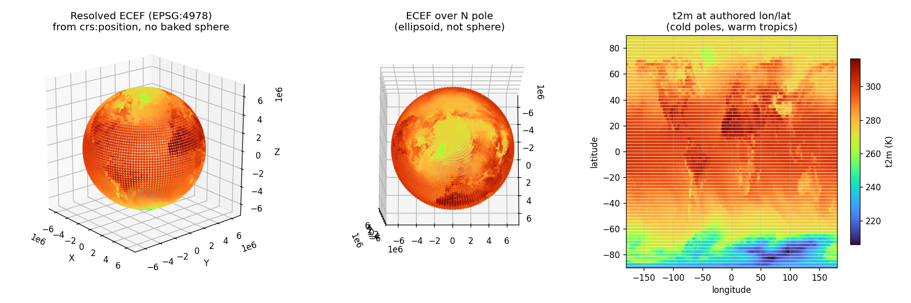

# Re-encoding Earth-2 as Georeferenced USD

A runnable prototype for the **Esri AOUSD Coordinate Reference System (CRS) proposal**,
demonstrated by re-encoding an already-OSS NVIDIA Earth-2 / NOAA GFS field as a
*georeferenced* USD scene instead of a baked Cartesian sphere.

It is built to clear the specific rock the prior geospatial effort hit: **how a CRS
reconciles with `UsdGeomXformable` — replace, wrap, or coexist?** The answer here is
*coexist*, demonstrated rather than argued.

## The design in one breath

* **Schema declares; runtime resolves.** This mirrors how Gaussian splats landed in
  OpenUSD — the `usdVol` schema is pure data and all splat behavior lives in the
  `hdParticleField` example — and how NVIDIA's `omniGeoSceneIndex` PoC resolved
  geospatial transforms in a Hydra scene index without changing `Xformable`.
* **Authored scene is CRS-neutral.** A `CoordinateReferenceSystem` prim carries an
  OGC **WKT2** string (`uniform token crs:wkt`). Each georeferenced `Xform` is bound
  to a CRS by a **relationship** (`rel crs:binding`) and carries an absolute geodetic
  position in a **float64** attribute (`crs:position`). There is **no
  `xformOp:translate` and no `SetResetXformStack`** in the authored data. The CRS
  type and the `crs:*` properties are a real registered **codeless schema**
  (`CoordinateReferenceSystem` + `CRSBindingAPI`), so they are authored
  `custom=False` truthfully and pass `usdchecker` / `UsdValidation` with no
  unknown-type/unknown-property complaints. See `schema/` and `schema/regen-schema.sh`.
* **Binding is a faithful analog of `UsdShadeMaterialBindingAPI`,** not a bare
  relationship: it supports **purpose** (`crs:binding:<purpose>`), **strength**
  (`bindCRSAs` = `weakerThanDescendants` default / `strongerThanDescendants`), and
  **collection-based** binding (`crs:binding:collection:<name>` resolved via
  `UsdCollectionAPI` membership). Proven by `src/test_binding_semantics.py` (S1–S7).
* **A separate runtime layer** reprojects `crs:position` from its source CRS to a
  target/render CRS (here WGS84 **ECEF**, EPSG:4978) via **PROJ**, producing the world
  cartesian transform — without writing anything back into the authored scene. The
  resolver **composes ancestor Cartesian `xformOp`s on top of** the georeferenced
  anchor (`world = ancestor_local_to_world · reproject(crs:position)`), which is the
  concrete demonstration of *coexist with `Xformable`* (proven by
  `src/test_ancestor_compose.py`). It also reads the target CRS from the stage's
  `defaultPrim` binding when not overridden on the CLI.

### Two normative contracts (see `docs/`)

* **Axis order** (`docs/axis-order.md`): `crs:position` is ALWAYS
  `(longitude/easting, latitude/northing, height)` — east-north-up / `always_xy` —
  regardless of the bound CRS authority's declared axis order. `verify.py` check **E**
  reads the *authored* WKT and fails if the data violates this.
* **Identity precedence** (`docs/crs-identity-precedence.md`): `crs:wkt` is
  **authoritative**; `crs:epsg` is an informational hint. `verify.py` check **F**
  fails on any disagreement so a stale hint cannot ship silently.

This keeps three things orthogonal that the v1 proposal entangled:
**composition** (a CRS prim arrives via standard `references`/`payloads`),
**binding** (an `Xform`→CRS relationship), and **behavior** (runtime reprojection).

## Why this clears the stall

The prior PoC and the v1 proposal baked runtime behavior into scene description
(`SetResetXformStack`, references-as-binding), forcing every downstream consumer to
inherit it and reopening "what does this do to `Xformable`?". Here the schema only
*declares* a binding — semantically inert, exactly like a material binding — and the
runtime is free to honor or ignore it. The transform API becomes an implementation
detail, which is precisely the path past the stall.

## Files

| file | role |
| --- | --- |
| `src/reencode_georef.py` | author OSS GFS t2m → CRS-neutral georeferenced USD (data only) |
| `src/resolve_runtime.py` | runtime: reproject `crs:position` → target CRS world cartesian (PROJ); optional `--bake` for a renderable artifact |
| `src/verify.py` | geodetic + contract checks A–F (CI-style, exits non-zero on failure) |
| `src/multi_crs_example.py` | worked multi-CRS scene with a non-circular negative control |
| `src/test_ancestor_compose.py` | proves the resolver composes ancestor `xformOp`s (coexist) |
| `src/test_binding_semantics.py` | proves MaterialBindingAPI-style strength/purpose/collection |
| `schema/` | codeless `CoordinateReferenceSystem` + `CRSBindingAPI`; `regen-schema.sh` |
| `src/render_evidence.py` | visual evidence: resolved ECEF globe + flattening + data-at-lon/lat |
| `src/render_globe_ovrtx.py` | hero render: globe mesh built from CRS-resolved ECEF vertices, path-traced with Omniverse RTX |

## Run

```bash
python3 src/reencode_georef.py --stride 10 --out out/earth2_georef.usda
python3 src/verify.py            out/earth2_georef.usda   # checks A–F
python3 src/multi_crs_example.py out/multi_crs.usda        # non-circular multi-CRS
python3 src/test_ancestor_compose.py                      # Xformable coexistence
python3 src/test_binding_semantics.py                     # binding strength/purpose/collection
bash    schema/regen-schema.sh --check                     # schema resources in sync
python3 src/resolve_runtime.py   --in out/earth2_georef.usda --bake out/earth2_resolved_ecef.usda
python3 src/render_evidence.py   --in out/earth2_georef.usda --out out/evidence.png
# hero render (needs ovrtx + a GPU):
python3 src/render_globe_ovrtx.py --in out/earth2_georef.usda --out-png out/globe_render.png
```

The schema auto-registers via `src/_schema_setup.py`, so the examples are
self-contained (no `PXR_PLUGINPATH_NAME` needed).

## Evidence (current)

* Authored scene is CRS-neutral — `verify.py` check **A** confirms no baked
  transform/reset.
* All samples bind to a CRS with parseable WKT2 — check **B**.
* Reprojection is geodetically correct — check **C**: the north pole resolves to
  ECEF *z* = 6 356 752.314 m (the WGS84 semi-minor axis *b*) and the equator/prime
  meridian to *x* = 6 378 137 m (semi-major *a*).
* Round-trip geographic→ECEF→geographic error ≈ **3 × 10⁻⁹ m** — check **D**.
* The resolved geometry shows WGS84 **ellipsoidal flattening** (mean equatorial
  radius ≈ 6 378 110 m vs polar ≈ 6 356 773 m): a true georeferenced Earth, not a
  baked sphere. See `docs/evidence.png`.
* **Multi-CRS composes — proven non-circularly** (`multi_crs_example.py`): a site in
  WGS84 geographic and the same site in its UTM zone resolve to the same ECEF point
  (sanity figure). The *proof* is a **negative control**: a third site reuses those
  exact easting/northing values but is bound to the wrong UTM zone, and the resolver
  must place it **>100 km away** (it lands ~1,655 km off). A resolver that ignored
  `crs:binding` would collapse it back — so the test has teeth (the earlier version's
  same-point check was tautological and is documented as such). UTM zone is
  auto-selected from longitude.
* **Binding semantics** (`test_binding_semantics.py`): nearest-wins, ancestor
  `strongerThanDescendants` override, purpose selection + fallback, and
  collection-member resolution with direct-beats-collection precedence — S1–S7 pass.
* **EPSG/WKT consistency** — check **F**; **axis-order contract** — check **E**
  (both with deliberately-failing negative cases verified).
* **Hero render** (`render_globe_ovrtx.py`): a globe mesh whose every vertex is
  produced by the CRS pipeline (`crs:position` → ECEF), path-traced with Omniverse
  RTX, colored by t2m — the recognizable Earth is constructed entirely by the
  standards-CRS resolution. See `docs/globe_render.png`.




## Status / next

* This is the **OpenUSD-side, Python-level** reference behavior, kept deliberately
  implementation-agnostic so it can inform the proposal and a C++ schema port.
* A parallel **NanoUSD** implementation (the second leg of the two-implementation
  evidence the strategy calls for) is intended but not built here.
* **Resolved since the first adversarial review** (`docs/codex-review.md`,
  `docs/review-fixes-summary.md`, running `docs/TLDR.md`):
  non-circular multi-CRS proof; demonstrated `Xformable` coexistence; real codeless
  schema; axis-order + identity-precedence contracts; full `MaterialBindingAPI`
  parity (strength/purpose/collection).
* **Still open:** external-grid-file / datum-epoch / time-dependent CRS asset path on
  `CoordinateReferenceSystem`; a compiled `usdchecker`-discoverable validator plugin
  (currently `verify.py` is the runnable validator); the NanoUSD leg.

## Data

NOAA **GFS** 2 m temperature, 0.25° global, fetched via NVIDIA **Earth2Studio**
(no API keys — open data). Re-used from the `earth2-ovrtx` example; nothing here
requires private inputs.
